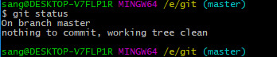
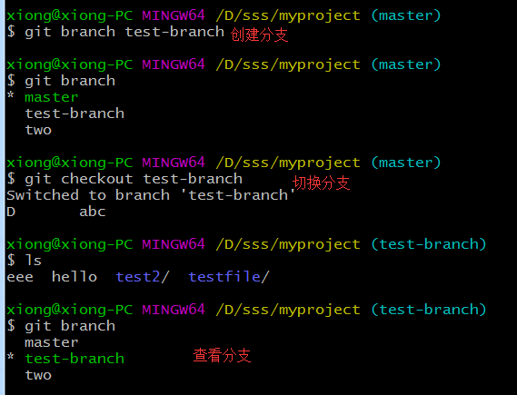
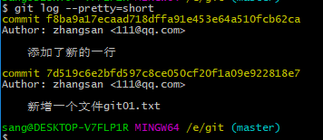
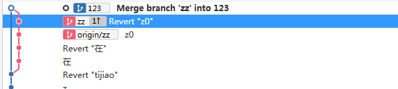

## gitlab


##### 目录

[gitlab](#gitlab)

[一、 目的](#一-目的)

[二、 Git基本操作](#二-git基本操作)

[(一) 注册账号](#一-注册账号)

[（二）初始化仓库及远程克隆仓库](#二初始化仓库及远程克隆仓库)

[（三） 查看仓库状态](#三-查看仓库状态)

[（六）提交及拉取](#六提交及拉取)

[（七）分支与标签](#七分支与标签)

[（八）合并](#八合并)

[（九）查看提交日志](#九查看提交日志)

[（十）查看更改前后的差异](#十查看更改前后的差异)

[（十一）压缩提交历史](#十一压缩提交历史)

[（十二）回滚代码到某个commit](#十二回滚代码到某个commit)

[1、git fetch和git pull的区别](#1git-fetch和git-pull的区别)

[2、基本快照](#2基本快照)

[2.1、git reset HEAD](#21git-reset-head)

[2.2、git rm](#22git-rm)

[2.3、git mv](#23git-mv)

[三、SourceTree使用](#三sourcetree使用)

[（一）从远程库克隆clone](#一从远程库克隆clone)

[（二）提交commit和推送push](#二提交commit和推送push)

[（三）拉取pull和获取fetch](#三拉取pull和获取fetch)

[（四）检出checkout](#四检出checkout)

[（五）合并merge](#五合并merge)

[（六）对比](#六对比)

[（七）回滚](#七回滚)

#### 一、 目的

备份文件、记录历史、为了能建立有效的执行反馈机制，加强信息的互动与交流，提高工作的效率和工作效能，确保各工程按目标执行，便于公司领导了解主要工作进展情况，公司实行工作周报制度，要求填写人员每周五15:00前报送本周周报。

#### 二、 Git基本操作

##### (一) 注册账号

首先打开公司内网部署GitLab的服务器，由于是内部员工使用，所以注册时候Username和Full name最好用自己的名字，这样管理员给用户分配项目权限的时候能够一目了然。 

 


##### （二）初始化仓库及远程克隆仓库

仓库的初始化有两种方式：一种是直接从远程仓库克隆，另一种则是直接从当前目录初始化。

2.1、远程仓库克隆

```
$ git clone <url> #克隆远程版本库        
    // 如 git clone git@192.168.9.19:myproject.git  
    //   git clone http://username:password@这里是ip:xx.git
```


2.2、仓库初始化

这里我们主要介绍当前目录初始化，远程仓库克隆我们在后面的文章中会说到。从当前目录初始化的方式很简单，直接执行如下命令:

```
$ git init  #初始化本地版本库
    //初始完之后需要clone 远程版本库下载新的数据
```

执行完成后当前目录下会多出一个.git的隐藏文件夹，所有git需要的数据和资源都存放在该目录中。

##### （三） 查看仓库状态

我们可以通过`git status`命令来查看仓库中文件的状态，比如，在我们仓库克隆或初始化完成之后，我们执行`git status`命令，执行效果如下：


执行结果首先展示了我们当前处于master分支下，然后又说暂时没有东西可以提交，因为当前仓库中还没有记录任何文件的任何状态。此时，我在当前目录下创建一个名为git01.txt的文件，然后再执行`git status`命令，如下：


此时执行结果中显示有一个未被追踪的文件就是我们刚刚添加的git01.txt，这个表示该文件目前并未被git仓库所管理，所以接下来我们要将这个文件添加到暂存区。

#####（四） 添加文件到暂存区

`git add`命令可以将一个文件添加到暂存区，我们现在已经有一个git01.txt文件了，接下来，执行如下命令将文件添加到暂存区中：

```
$ git add git01.txt
```

文件添加到暂存区之后，我们再执行`git status`命令，可以看到如下结果：


文件提交到暂存区之后，我们看到此时的状态已经发生了变化。

#####（五） 提交到本地仓库

当文件提交到暂存区之后，此时我们可以通过`git commit`命令将当前暂存区的文件提交到本地仓库，如下：


注意，执行commit命令时，我们需要加上提交备注，即-m参数，提交成功之后，我们再执行git status命令，结果如下：



此时一切又恢复宁静了，没有需要add的东西，也没有需要commit的东西。

如果我们要写的备注非常多，我们可以直接执行git commit命令，此时会自动打开一个vi编辑器，我们直接在编辑器中输入备注信息即可。假设我在git01.txt中随意添加一行内容，然后依次执行git add、git commit命令，此时系统会自动打开一个vi编辑器，如下：


如图所示，我们在vi编辑器中按照既定的格式编辑内容，编辑完成之后保存退出，此时文件就commit成功了。如果在备注信息编辑的过程中我们不想提交了，则直接删除备注信息，保存退出，此时提交就终止了，如下：


提交成功之后，我们可以通过如下命令修改提交备注：

```
git commit --amend
```

运行该命令，会自动打开vi编辑器，此时我们可以重新编辑上次提交的备注信息。

##### （六）提交及拉取

pull：是下拉代码，相等于将远程的代码下载到你本地，与你本地的代码合并。

 push：是推代码，将你的代码上传到远程的动作 。

完整的流程是： 

1、git add .（后面有一个点，意思是将你本地所有修改了的文件添加到暂存区） 。

2、git commit -m""(引号里面是你的介绍，就是你的这次的提交是什么内容，便于你以后查看，这个是将索引的当前内容与描述更改的用户和日志消息一起存储在新的提交中) 。

3、git pull origin master 这是下拉代码，将远程最新的代码先跟你本地的代码合并一下，如果确定远程没有更新，可以不用这个，最好是每次都执行以下，完成之后打开代码查看有没有冲突，并解决，如果有冲突解决完成以后再次执行1跟2的操作 。

4、git push origin master 将代码推至远程就可以了 。


##### （七）分支与标签

```
$ git branch #显示所有本地分支
$ git checkout <branch/tagname> #切换到指定分支或标签
$ git branch <new-branch> #创建新分支
$ git branch -d <branch> #删除本地分支
$ git tag #列出所有本地标签
$ git tag <tagname> #基于最新提交创建标签
$ git tag -d <tagname> #删除标签
```

6.1、创建及查看

 

6.2、删除

 

6.3、分支操作

 

##### （八）合并

```
$ git merge <branch> #合并指定分支到当前分支
```

merge 例：

 	 $ git branch test-branch           //创建分支 

 

```
$ git checkout two    // 切换分支
$ touch 分支two测试  // 分支创建一个文件

$ git checkout test-branch
$ git merge two         //最后ls查看就能看到two创建的文件了
```

##### （九）查看提交日志

通过`git log`命令我们可以查看以往仓库中提交的日志，比如提交的版本号、提交者、提交者邮箱、提交时间、提交备注等信息，如下：


有的时候我们要查看的命令并不用这么详细，可以在`git log`后面加上`--pretty=short`，这样显示出来的就只是简略信息了：



此时显示出来的是我们这个仓库中的所有日志信息，如果我只想查看某一个文件的提交日志，在`git log`后面加上文件名即可。如下：


如果我还想查看提交时文件的变化，加上-p参数即可，如下：


绿色的+表示新增的行，红色的-表示删除的行（当然这里没有删除的行）。

但是`git log`有一个局限性，就是不能查看已经删除的commit的日志，举个例子：下班了，我发现今天下午提交的代码全都是有问题的，于是做了一个版本回退，回退到今天早上的状态，然后关机回家，第二天来了后我发现搞错了，其实那些代码都是OK的，于是我又想让仓库版本前进到昨天下午的状态，却发现git log命令查看不到昨天下午提交的版本号。此时，我们可以使用`git reflog`命令来实现这一个请求，`git reflog`命令可以显示整个本地仓库的commit, 包括所有branch的commit, 甚至包括已经撤销的commit, 只要HEAD发生了变化, 就会在reflog里面看得到，而git log只显示当前分支的commit，并且不显示删除掉的commit。如下图：


##### （十）查看更改前后的差异

使用`git diff`命令我们可以查看工作区和暂存区的区别以及工作区和最新提交的差别。我往git01.txt文件中再添加一行hello world，此时执行`git diff`命令，结果如下： 


此时这里显示我们新增了一行。此时我们执行git add命令，将文件提交到暂存区，然后再执行git diff，如下：


此时没有任何信息输出，因此此时工作区的内容和暂存区的内容已经保持一致了。但是此时工作区和本地仓库中最新提交的内容还是不一致，我们可以通过`git diff HEAD`命令来查看，如下：


此时我们需要执行git commit命令将暂存区中的文件提交，提交成功之后，再执行`git diff HEAD`命令，则又恢复宁静了。如下：


##### （十一）压缩提交历史

`git rebase -i`命令可以实现提交历史的压缩。比如我们在开发某一个功能时，提交了很多次，当所有功能都写完时，想将这些提交压缩为一个，就可以使用该命令，如下：


如上图，该命令执行之后，会自动打开一个vi编辑器，在vi编辑器中将最新提交的日志的pick改为fixup即可。压缩之后，最新一次的提交日志就没了，但是数据还在。

##### （十二）回滚代码到某个commit


（十二）其他

##### 1、git fetch和git pull的区别

1. *git fetch*：相当于是从远程获取最新版本到本地，不会自动合并。

```
$ git fetch origin master
$ git log -p master..origin/master
$ git merge origin/master

Shell
```

以上命令的含义：

- 首先从远程的`origin`的`master`主分支下载最新的版本到`origin/master`分支上
- 然后比较本地的`master`分支和`origin/master`分支的差别
- 最后进行合并

##### 2、基本快照

Git 的工作就是创建和保存你的项目的快照及与之后的快照进行对比。

##### 2.1、git reset HEAD

git reset HEAD 命令用于取消已缓存的内容。

我们先改动文件 README 文件，内容如下：

```
# Runoob Git 测试
# 教程 
```

hello.php 文件修改为：

```
<?php
echo '教程：www.runoob.com';
echo '教程：www.runoob.com';
echo '教程：www.runoob.com';
?>
```

现在两个文件修改后，都提交到了缓存区，我们现在要取消其中一个的缓存，操作如下：

```
$ git status -s
 M README
 M hello.php
$ git add .
$ git status -s
M  README
M  hello.php
$ git reset HEAD hello.php 
Unstaged changes after reset:
M    hello.php
$ git status -s
M  README
 M hello.php
```

现在你执行 git commit，只会将 README 文件的改动提交，而 hello.php 是没有的。

```
$ git commit -m '修改'
[master f50cfda] 修改
 1 file changed, 1 insertion(+)
$ git status -s
 M hello.php
```

可以看到 hello.php 文件的修改并未提交。

这时我们可以使用以下命令将 hello.php 的修改提交：

```
$ git commit -am '修改 hello.php 文件'
[master 760f74d] 修改 hello.php 文件
 1 file changed, 1 insertion(+)
$ git status
On branch master
nothing to commit, working directory clean
```

简而言之，执行 git reset HEAD 以取消之前 git add 添加，但不希望包含在下一提交快照中的缓存。

##### 2.2、git rm

如果只是简单地从工作目录中手工删除文件，运行 git status 时就会在 Changes not staged for commit 的提示。

要从 Git 中移除某个文件，就必须要从已跟踪文件清单中移除，然后提交。可以用以下命令完成此项工作

```
git rm <file>
```

如果删除之前修改过并且已经放到暂存区域的话，则必须要用强制删除选项 -f

```
git rm -f <file>
```

如果把文件从暂存区域移除，但仍然希望保留在当前工作目录中，换句话说，仅是从跟踪清单中删除，使用 --cached 选项即可

```
git rm --cached <file>
```

如我们删除 hello.php文件：

```
$ git rm hello.php 
rm 'hello.php'
$ ls
README
```

不从工作区中删除文件：

```
$ git rm --cached README 
rm 'README'
$ ls
README
```

可以递归删除，即如果后面跟的是一个目录做为参数，则会递归删除整个目录中的所有子目录和文件：

```
git rm –r * 
```

进入某个目录中，执行此语句，会删除该目录下的所有文件和子目录。

##### 2.3、git mv

git mv 命令用于移动或重命名一个文件、目录、软连接。

我们先把刚移除的 README 添加回来：

```
$ git add README 
```

然后对其重名:

```
$ git mv README  README.md
$ ls
README.md
```
#### 三、SourceTree使用

##### （一）从远程库克隆clone

clone就是将远程库的代码拷贝到本地。

1、填写远程和本地项目路径，点击“克隆“。这样就会将服务器上项目代码克隆到本地了。 


##### （二）提交commit和推送push

**commit**将工作空间修改提交到本地库。

**push**将本地库修改提交到远程库。

新建一个文档放入克隆到本地的库中，它将会在为暂存文件显示，点击暂存所有，文件将到已暂存文件处，并填写提交内容，提交内容格式详情看：[提交日志规范](http://192.168.70.10:8088/knowledge-base/wiki/blob/master/01%E6%96%B0%E6%89%8B%E6%8C%87%E5%8D%97/01%E5%9B%A2%E9%98%9F%E5%85%A5%E9%97%A8%E6%8C%87%E5%8D%97.docx )。提交成功后，点击推送。将本地仓库推送push到远程库。


将本地仓库推送push到远程库。跟踪需勾选。


注意事项：若库里有文件更新，需先拉取，才能提交。

##### （三）拉取pull和获取fetch

**pull** 从远程拉取最新版本 到本地  自动合并 merge

**fetch**   从远程获取最新版本 到本地   不会自动合并 merge


虚线表示拉取到本地仓库，实现表示拉取到本地仓库，并合并到工作空间。

假如有冲突，使用解决冲突。


#####  （四）检出checkout

**checkout **创建分支，切换分支。

**checkout**如果只有当前分支，则会新建一个分支。

如果是两个分支间checkout，则会切换分支。


相当于checkout命令 创建了新分支，并切换到了这个分支。 点击鼠标右键，点击“分支”。

##### （五）合并merge

选中两个你要合并的分支，点击合并。


选择相应的，点击确认。




##### （六）对比

选中两个要对比的分支。


##### （七）回滚

回滚版本到某次提交,操作步骤：

1、打开sourceTree,切换到开发分支。


2、打开本地工作副本test1.txt文件，编辑新增add test1。


3、提交并推送本次新增到远程仓库 。


4、打开本地工作副本test1.txt文件，编辑新增 add test2 。


5、 提交并推送本次修改到远程仓库，可以看到最新的历史记录在本地仓库和远程仓库都已有了新增test1和新增test2 。


6、如果这个时候突然发现前面的两次提交是错误的，现在想回到“提取release分支的某次提交到develop分支”这个版本。有两种解决方式，第一种是删除掉新增test1和新增test2两次提交所加的内容，但是这有个前提，是修改内容很少的情况下才可以采用此方法，否则会陷入无穷无尽的代码比对泥沼。那么第二种方式就是该教程将要讲述的。回退到某个历史版本。 


7、切换到sourceTree界面，打开develop分支的日志/历史，鼠标选中将要回退到的那个历史提交记录 。


8、右键-》重置当前分支到此次提交 。


9、在弹窗中 使用模式选择 强行合并--丢弃所有改动过的工作副本，点击确定 。


10、等待重置完，可以看到本地仓库的develop分支已回退到 “提取 release分支的某次提交到 develop分支”提交。而且本地仓库落后远程仓库两个提交记录。 


11、依然是同样的操作。选中最新的提交历史记录，右键-》重置当前分支到此次提交。


12、这次选的使用模式是软合并 – 保持所有本地改动，点击确定 。


13、等待重置完。发现本地仓库开发分支已和远程仓库开发分支同步。这个结果似乎看起来两次重置抵消了一样，代码版本没有发生任何的变化。实际并不是这样，这就是神奇之处，会让你恍然大悟的地方。 


14、切换到文件状态，可以看到本地工作副本多了一个test1.txt的改动文件，而且改动文件的内容正好删除了 新增test1和新增test2两次提交所修改的内容。 


15、那么，剩下的操作只需将这个改动文件提交并推送到远程仓库，是不是就OK了？下面尝试，提交并推送该改动文件。如下图，推送之后的效果。


16、如下图，可以看出本地工作副本和远程仓库的 add test1 和 add test2内容都被回退掉了。也就是代码版本从内容上回退到了某个历史版本，但是提交历史记录并没有回退。Git只会增加提交历史记录，是不会回退或删除提交记录的。我们所说的回退都是指的回退内容。 

