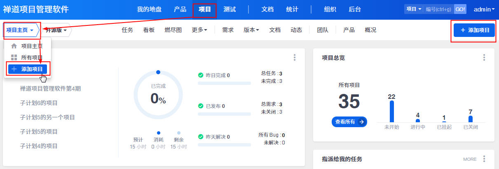
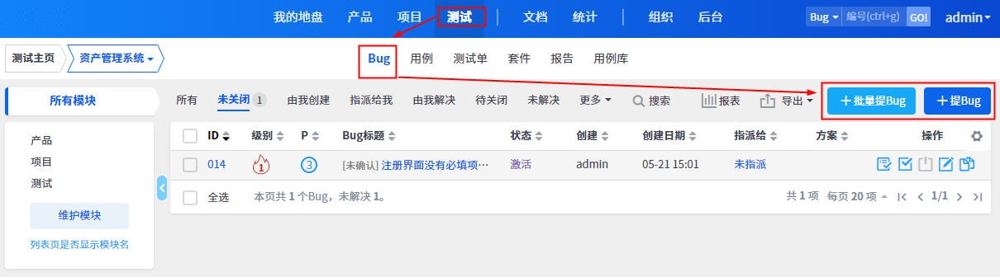

## 禅道

##### 目录

[目录](#目录)

[一、禅道软件](#一禅道软件)

[二、产品](#二产品)

[三、创建项目](#三创建项目)

[四、看板](#四看板)

[五、 测试](#五-测试)

[六、 任务](#六-任务)

[(一)分解任务](#一分解任务)

[(二)多人任务](#二多人任务)

[七、Bug](#七bug)

[八、工时](#八工时)

------

#### 一、禅道软件

它集产品管理、项目管理、质量管理、文档管理、组织管理和事务管理于一体，完整覆盖了研发项目管理的核心流程。禅道功能完备丰富，操作简洁高效，界面美观大方，搜索功能强大，统计报表丰富多样，软件架构合理等，同时能更好的全面掌握项目进展。

#### 二、产品

禅道的设计理念是围绕产品展开的，因此我们首先要做的就是创建一个产品。进入产品主页，在1.5级导航的下拉菜单中，选择“添加产品”。或者先进入“所有产品”页面，点击右侧的“添加产品”。之后便可以添加产品的具体信息。[详情请点击查看](https://www.zentao.net/book/zentaopmshelp/77.html)

                                                  

#### 三、创建项目

创建项目的入口有多个：

a.进入项目视图，点击左侧1.5级导航下拉菜单，可以直接点击“添加项目”。

b.或者先进入所有项目页面，点击右侧的“添加项目”按钮。

c.再或者在项目主页中的项目总览区块中也有“添加项目”按钮。

   

进入项目添加的页面后，在这个页面设置==任务类型、所属模块、指派人、相关需求、任务名称、优先级、预计时间、任务起止时间（以上必填）==，其他字段视情而定。[详情请点击查看](https://www.zentao.net/book/zentaopmshelp/46.html%20)

注意事项：

- 必须填写：类型、模块、指派人、需求、任务名称、预计时间、优先级、任务起止时间。
- 任务进行中只有一个，不允许出现许多任务同时开启。
- 建议：任务预计时间不超过3个小时。

#### 四、看板

1、看板功能 

物理介质的看板比较直观，是Scrum标准的管理工具，但也有其很多的局限。我们仿照物理白板做了一个电子看板，主要功能如下： [详情请点击查看](https://www.zentao.net/book/zentaopmshelp/256.html)

- 在看板界面可以查看当前项目（迭代）的需求以及其对应的任务列表；

- 项目中关联的需求可以按照不同的字段进行排序；

- 任务的拖拽功能。可以将任务从不同的状态拖到其他的状态栏中；

- 显示当前项目的Bug，标题前面有小虫子图标的是Bug；

- 指派给当前操作者的任务，会高亮显示。 

#### 五、 测试

当研发人员申请测试之后，会生成相应的测试版本给测试人员，操作步骤：

1、进入项目视图，点击二级导航下拉菜单中的“测试单”，点击提交测试。或者在版本列表中，直接点击对应的提交测试。

2、在提交测试的页面，编辑创建测试单。[详情请点击查看](https://www.zentao.net/book/zentaopmshelp/166.html)

视频：<https://www.zentao.net/video/use-of-zentao-test-team-79957.html>

#### 六、 任务

##### (一)分解任务

在项目的需求列表页面，可以很方便地对某一个需求进行任务分解。同时还可以查看这个需求已经分解的任务数。列表字段中的 T/B/C分别代表 任务数/bug数/用例数。[详情请点击查看](https://www.zentao.net/index.php?m=book&f=read&id=86)

  

##### (二)多人任务

建任务的时候，指派给选择框里，勾选多人。出现团队按钮，点击团队，就可以选择将该任务指派给多人。在团队里，选择团队成员，填写上对应的预计工时。最右侧的向上和向下的箭头，可以排序。[详情请点击查看](https://www.zentao.net/index.php?m=book&f=read&id=86)

#### 七、Bug

1、进入测试视图的“Bug”。

2、点击页面右侧的"提Bug"，即可进入Bug创建页面。 [详情请点击查看](https://www.zentao.net/index.php?m=book&f=read&id=61)

 

#### 八、工时

工时管理是人力资源管理新的重要课题,在成本、效率、质量等之间,透过有效之工时管理 ，领导层可更清晰的看到每个员工的工作情况。

填写要求：

根据实际情况填写，每完成、中断等项目时，及时更新工时情况。

工时登记时间一次一般不超过3个小时。