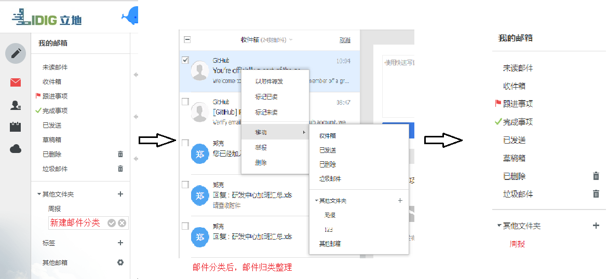

## **邮件**

#### 目录

[<strong>邮件</strong>](#邮件)

[一、如何进入钉邮](#一如何进入钉邮)

[二、功能](#二功能)

[(一)邮件编辑](#一邮件编辑)

[(二)钉邮已读未读](#二钉邮已读未读)

[(三)钉邮转DING](#三钉邮转ding)

[(四)发起群聊](#四发起群聊)

[(五)选择文件](#五选择文件)

[(六)邮件穿透](#六邮件穿透)

[(七)邮件分类](#七邮件分类)

[(八)PC端登录钉邮](#八pc端登录钉邮)

[(九)日程](#九日程)

------

#### 一、如何进入钉邮

钉邮的进入界面是在钉钉的主界面上，左下角有一个右键的标识，点击一下就可以进入钉邮的界面了。

#### 二、功能

##### (一)邮件编辑

钉邮主要的功能有基本的发邮件，创建自己的日程，到时候会有消息提醒你及时跟进自己的日程，避免耽误事情。点击钉邮的新建邮件，编辑好邮件的内容，下面可以添加附件，可以是压缩包，也可以是图片等等。

 

##### (二)钉邮已读未读

在邮件参与人界面显示已读未读，邮件状态实时可见。

##### (三)钉邮转DING

点击邮件详情界面或邮件参与人界面DING图标，可以快速转入DING界面，一键发送。

##### (四)发起群聊

点击邮件详情界面右下角或邮件参与人界面消息图标，可以快速创建聊天。

##### (五)选择文件

-   点击钉盘“云形”图标，可调用钉盘文件
-   点击相机图标，可选择本地照片或拍照
-   Android系统还可上传本地文件作为附件

##### (六)邮件穿透

-   点击邮件参与人界面右侧聊天图标，可将邮件穿透发送到聊天。
-   聊天界面点击邮件可直接查看邮件。
-   点击左向单箭头和双箭头可以进行快速的回复和全部回复，点击右向的箭头可以进行转发邮件。

##### (七)邮件分类

**方法一：**设置收信规则，在你收到信时，自动为你分类，方便快捷，提高工作效率。设置步骤如下：

1、登录邮箱后点击右上角“邮箱设置”，在左侧展开设置功能列表中点击“收信规则”，点击“添加收信规则”。 

2、首先输入规则名称，然后勾选邮件到达时的条件（发件人、收件人、主题、邮件大小、带附件），并输入具体条件内容。 

3、设置符合条件时的执行动作，如移动、设置标签、标记跟进等等。 

4、最后勾选“创建成功后对历史邮件执行规则”，保存即可。 

**方法二：**工作一般由邮件形式发送，如此大量邮件混为一滩，会导致杂乱无章。对邮件进行分类和筛选，这会大大提高你的工作效率。

##### (八)PC端登录钉邮

点击钉钉电脑客户端左下角钉邮，可进入网页版钉钉邮箱。

注意：手机端登陆的是钉邮，PC端点击钉邮图标进入的是钉邮的网页版，如果手机端登陆的是阿里云的企业邮箱，那么PC端登录的是企业邮箱。如果手机端没有登录任何邮箱，PC端没有钉邮图标。

##### (九)日程

可记录重要事情的提醒，以及每天的待办事项。可同步手机日历、考勤日历、写日志、钉邮日程、阿里邮箱日程。 新建流程：

1、登录邮箱，点击左下角的“日历”按钮，然后点击左上角“新建日程”后，打开会议邀请的页面。

2、输入必选及可选参会者，同时可查看与会者的时间计划，输入会议主题、地点、时间。还可选择提醒时间，如是固定会议可通过“重复规则”选择会议频率，最后输入会议简要点击发送邀请。

 