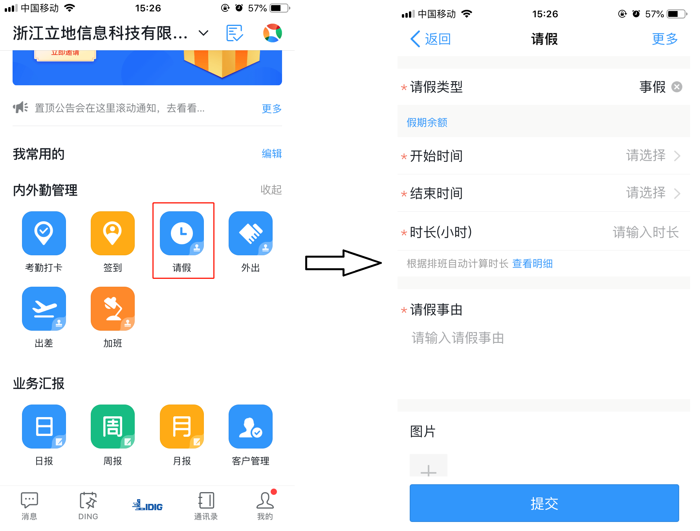
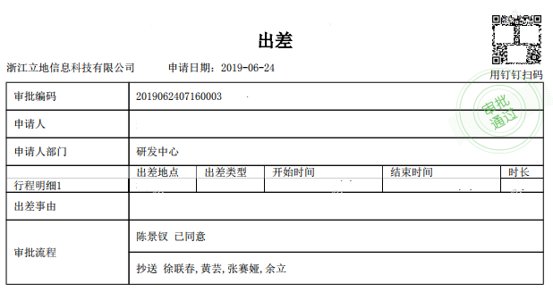
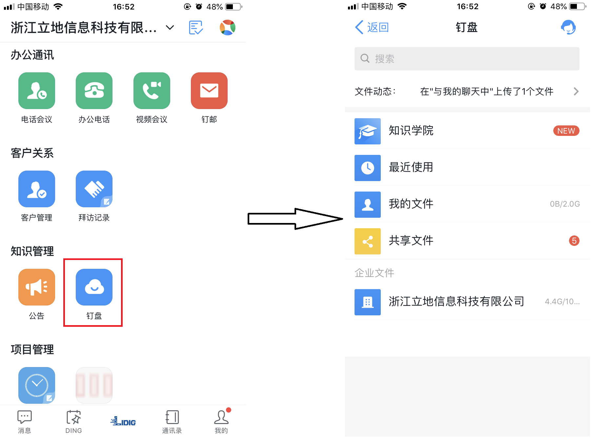
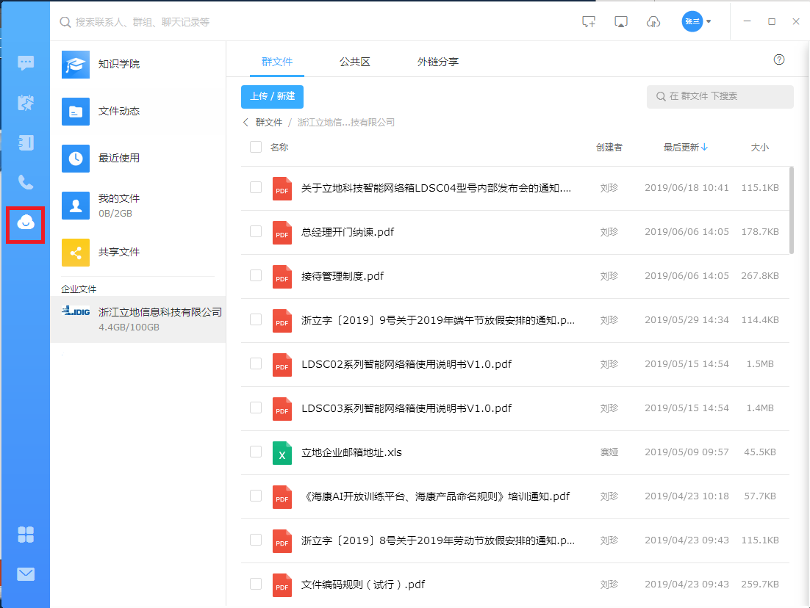
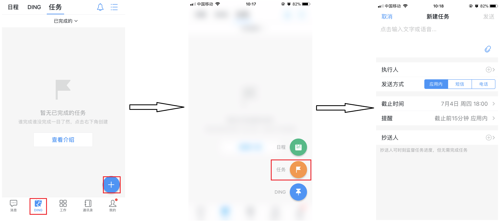
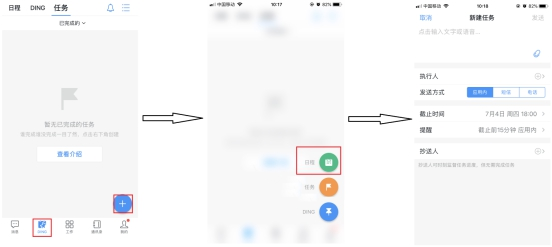
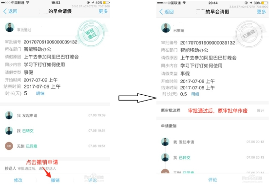
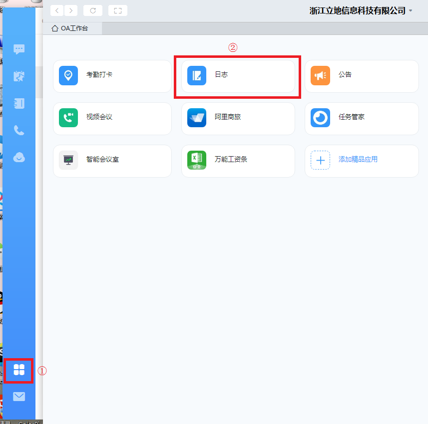
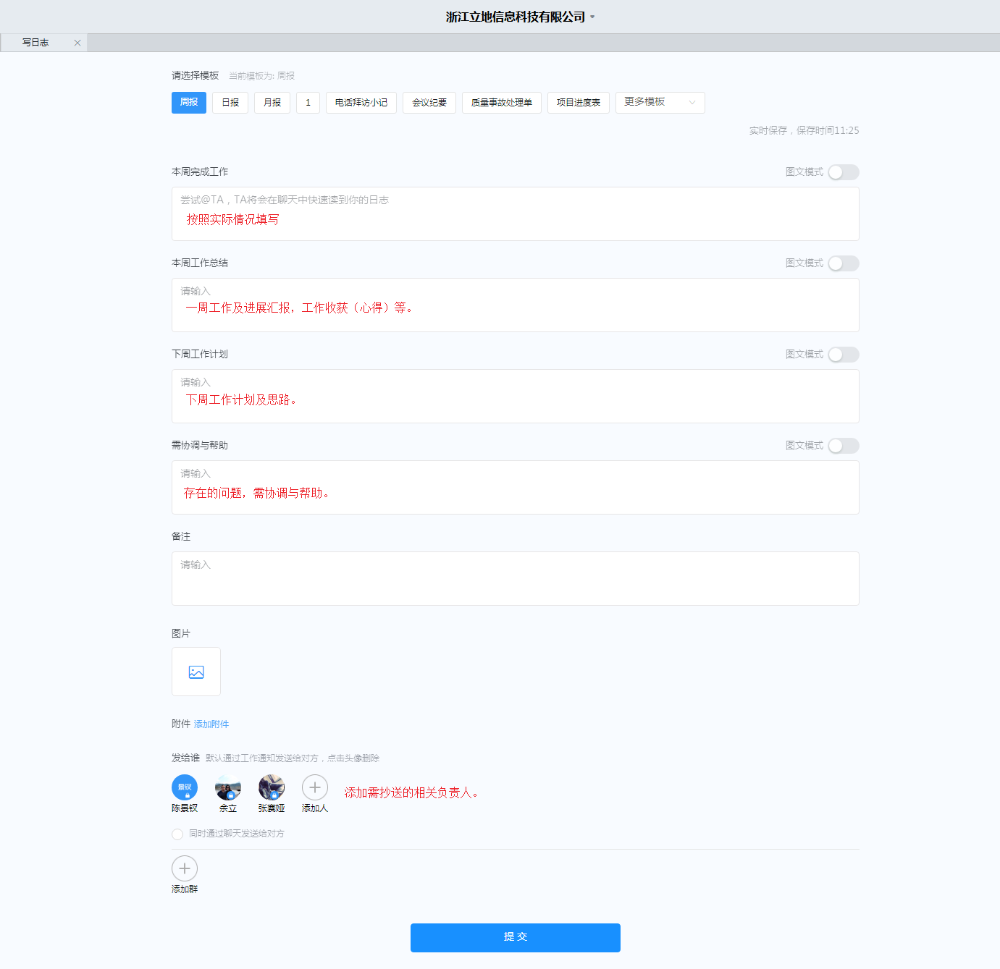

## 钉钉使用说明

#### 目录

[钉钉使用说明](#钉钉使用说明)

[目录](#目录)

[一、考勤打卡](#一考勤打卡)

[二、请假](#二请假)

[三、 出差](#三-出差)

[四、 审批](#四-审批)

[五、钉盘](#五钉盘)

[六、任务](#六任务)

[七、日程](#七日程)

[八、销假](#八销假)

[九、钉钉周报](#九钉钉周报)

------

  

#### 一、考勤打卡

登录手机端客户端，点击工作，在工作界面找到考勤打卡，要求一天打卡两次，上午8:30之前打卡上班，下午17:30之后打卡下班。考勤打卡分两项规则。（备注：若当天有请假记录，注意上下班的打卡时间。例如：上午请假，下午上、下班时需打卡，否则会出现缺卡情况。）

内勤打卡：应在上班时间（8:30）前下班时间（17:30）后，考勤范围即可签到；

外勤打卡：应在上班时间（8:30）前下班时间（17:30）后。

具体步骤如图所示：

                         

备注：请允许钉钉退送后台消息通知，不要退出钉钉后台，保持网络信号的畅通。考勤打卡消息提醒：规定上班时间5-10分钟前会推送上班打卡消息提醒，规定下班时间自动打卡（为以防万一下班后请登入钉钉上查看）。

#### 二、请假

登录手机端客户端，点击工作，在工作界面找到请假。任何类别的假期都需要通过钉钉发去审批，需经有权审批领导同意后方可生效。请假流程如图所示：

#### 三、 出差

登录手机端客户端，点击工作，在工作界面找到出差。需经有权审批领导同意后方可生效。出差结束后需报销差旅费及出差产生的费用，请打印出差表。请假流程如图所示：

#### 四、 审批

员工发起请假、出差、外出等审批时需要进行逐级审批，逐级审批时，按照设置好的先后顺序进行逐级审批，统一、拒绝审批均可填写理由，会同步展示在审批页面。提交后等待审批人审批，可发DING消息提醒，支持撤销。

#### 五、钉盘

登录手机端客户端或PC端，点击工作，在工作界面找到钉盘，可以查看，分为企业公共、企业群、个人领域。方便查看公开文件。

手机端操作流程如图所示：

PC端操作流程如图所示：

#### 六、任务

钉钉任务可分配多人执行，还可设置抄送人，监督任务进度。多种通知方式：电话、短信、应用内3种方式发生任务、到期前提醒，任务管理轻松简单。同时可实时跟踪，逾期自动提醒。跨部门之间协作，任务是否完成一目了然，抄送人可监督进度，未完成可催办，团队协同更高效。下达、分配任务流程如图所示：

#### 七、日程

在钉钉里日程这一项，有会议、ding、任务、通知这几项，安排到个人的会议、任务会在指定时间提示，并显示在个人的日程里，并可以分别按日、周、月查看日程安排。任务完成情况，在日程里无法体现。

 

#### 八、销假

(一) **修改时间**

提交时间错误、提早回来修改时间等，如下操作：

 

(二) **撤销**

1、若审批单还在审批过程中是可以撤销的，只能撤回自己的，不可以帮他人撤回哦，手机端/客户端点击【工作】-【审批】-【我发起的】点击审批  【撤回】;

2、审批通过后，需撤销、销假等，须填写撤销理由，等待再次审核通过，操作如下：

  

**（三）补卡申请**

#### 九、钉钉周报

周报是给自己的工作作不断的提炼和总结，使自愿和效能发挥到最大。同时可以提高个人的计划、时间管理、目标管理方面的素质和能力 。

