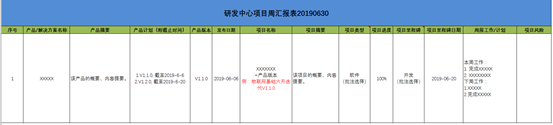

## **周报**

####  

#### 目录

[一、目的](#一目的)            

[二、职责](#二职责)             

[三、项目周报和员工周报区别](#三项目周报和员工周报区别)              

[（一）项目周报](#一项目周报)               

[（二）员工周报](#二员工周报)            

[四、管理细则](#四管理细则)               

[(一)   工作周报的内容](#一---工作周报的内容)               

[(二)    周报报送要求](#二----周报报送要求)                

[（三）工作周报管理要求](#三工作周报管理要求) 

------

 

#### 一、目的

为了能建立有效的执行反馈机制，加强信息的互动与交流，提高工作的效率和工作效能，确保各工程按目标执行，便于公司领导了解主要工作进展情况，公司实行工作周报制度，要求填写人员每周五15:00前报送本周周报。

#### 二、职责

员工：按工作周报的模板详细填写，及时提交给相应负责人。

项目组负责人：按工作周报的模板详细填写，及时提交给相应负责人。

部门助理：督促需上交周报，每周五15:00前汇总本周周报，发送部门负责人。

部门负责人：对本部门员工周报情况进行监督和检查，与员工工作完成情况及工作计划进行交流。

#### 三、项目周报和员工周报区别

##### （一）项目周报

针对项目组人员的周报要求，每天必须及时了解、补充和更新信息，做到对自己所负责项目进度了如指掌，抓住项目进程的重点，掌控全局；项目突破的关键问题必须及时发现、及时交流、及时解决；以上所有信息要做到在周报中能体现清楚。

##### （二）员工周报

周报内容主要包括：

- 本周工作重点及完成进展情况；
- 本周工作中存在的问题及解决思路；
- 下周工作计划；
- 填写要求，点击查看。

#### 四、管理细则

##### (一)   工作周报的内容

周报的内容。本周工作总结，下周工作计划，需要公司主管级以上人员或其他部门协调、协助解决的工作事项，其他需要说明的工作事项。

##### (二)    周报报送要求

1、报送时间：每周五15:00前；

2、文件命名：部门+项目周报汇报表+年份-第XX周XX月XX日-XX月XX日+姓名。例：研发中心项目周汇报表-2019年-第28周7月8日-7月14日）张三；

3、填写人员需按照模板的内容认真填写周报，要求内容详实，格式规范；

4、填写人员须在每周周五15:00前按级提交本周周报，遇法定节假日应在放假前提交；

5、填写人员如遇出差、公出等特殊原因不能按时提交的，须提前报备,回公司后立即补交周报。

#####  （三）工作周报管理要求

- 上级领导每周一收集项目成员的工作周报并给出个人评价意见；
- 员工不能及时准确提交周报，上级领导应予以批评督促；

**后附：工作周报模板图**

附件1： [项目组工作周报模板(Excel)，点击可下载 ](http://192.168.70.10:8088/knowledge-base/wiki/blob/master/01%E6%96%B0%E6%89%8B%E6%8C%87%E5%8D%97/01%E9%80%9A%E7%94%A8%E7%9F%A5%E8%AF%86/assets/%E7%A0%94%E5%8F%91%E4%B8%AD%E5%BF%83%E9%A1%B9%E7%9B%AE%E5%91%A8%E6%B1%87%E6%8A%A5%E8%A1%A820190630%E5%BC%A0%E4%B8%89%EF%BC%88%E6%A8%A1%E6%9D%BF%EF%BC%89.xlsx  )

****

附件2：员工周报模板（钉钉上提交）[具体操作流程点击查看](http://192.168.70.10:8088/knowledge-base/wiki/blob/master/01%E6%96%B0%E6%89%8B%E6%8C%87%E5%8D%97/01%E9%80%9A%E7%94%A8%E7%9F%A5%E8%AF%86/04%E9%92%89%E9%92%89.md )

