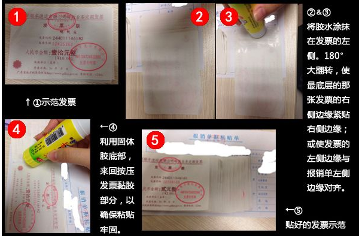

## **制度**

------

**目录**

  * [<strong>制度</strong>](#制度)

       [一、考勤制度](#一考勤制度)

       [(一)工作时间](#一工作时间)

       [(二)出勤方式](#二出勤方式)

       [(三)请假方式](#三请假方式)

       [(四)请假审批权限](#四请假审批权限)

       [(五)惩罚](#五惩罚)

       [(六)考勤补卡](#六考勤补卡)

       [(七)请假类型](#七请假类型)

       [二、报销流程](#二报销流程)

       [（一）发票信息](#一发票信息)

       [（二）费用报销](#二费用报销)

       [（三）差旅补贴报销](#三差旅补贴报销)

       [（四）费用报销票据粘贴规范](#四费用报销票据粘贴规范)

       [（五） 注意事项](#五-注意事项)

------

#### 一、考勤制度

##### (一)工作时间

每周工作5天，每周一至每周五，实行双休制度。上午：8:30~11:45，下午：13:30~17:30。（结果为导向定义：能完成公司下达本周任务的员工实行双休）

##### (二)出勤方式

采用钉钉考勤打卡方式，全体员工采用钉钉上下班打卡。

##### (三)请假方式

钉钉发起请假审批。任何类别的假期都需要通过钉钉发去审批，需经有权审批领导同意后方可生效。[请假流程](http://192.168.70.10:8088/knowledge-base/wiki/blob/master/01%E6%96%B0%E6%89%8B%E6%8C%87%E5%8D%97/01%E9%80%9A%E7%94%A8%E7%9F%A5%E8%AF%86/04%E9%92%89%E9%92%89.md )

##### (四)请假审批权限

员工请假3天及以内由部门负责人审批后交办公室备案；员工请假3-7天的应由部门负责人和行政总监审批后交办公室备案；员工请假7天及以上的应由部门负责人、行政总监和总经理批准后交办公室备案。

##### (五)惩罚

1、迟到早退：扣半天工资；

2、普通事假请假1天扣除1天工资，旷工1天，扣除3天工资。扣工资计算办法，按照月工资除以30日计算。

##### （六）考勤补卡

1、每人每月可提交补卡申请两次；

2、补卡申请只限发起当天内的补卡（系统已设定超过当天将无法申请）；

3、补卡原因需详细说明（由补卡流程审批人视具体情况，确认是正常考勤时间内到公司后，因客观原因造成的漏打卡方可审批通过。否则，按迟到处理。）；

4、若当天有请假记录，注意上下班的打卡时间（例如：上午请假，下午上、下班时需打卡，否则会出现缺卡情况。）；

5、非工作日加班，上、下班均需手动打卡。

##### (七)请假类型

1、事假

因私人原因请事假，事假期间不支付工资。扣发实际事假缺勤天数的薪资，扣工资计算办法，按照月工资除以30日计算。

2、病假

员工请病假需提供医院的医疗证明，否则按事假处理。员工请病假可发放基本工资，不予发放岗位工资。

3、年休假

公司正式员工工作满一年享受带薪年休假，中途离职年假扣回。国家法定休假日不计入年休假的假期。年休天数根据司龄阶段，司龄是指在本公司在职年限。司龄 1 年为 4 天，2-10 年为 5 天，10-20年 10 天，20 年以上为 15 天。

4、婚丧假

凡与公司签订劳动合同的正式员工，可享受婚嫁、丧假 3 天，需提前 3 天申请，且不可分段申请假期，其假期薪资按固定薪资全额发放。

5、 产假

公司女性正式员工工作满一年后可享受 98 天产假，中途离职产假扣回。其假期薪资参考生育津贴发放。

------

 

#### 二、报销流程

##### （一）发票信息

1、浙江立地开票资料（必须为公司全称，不可以是个人、贵宾、顾客）

公司名称：浙江立地信息科技有限公司

税务登记号：91330300329821058T

开户行：中国工商银行股份有限公司温州分行

账号：1203202009045700827

公司电话：0577-86573800

公司地址：温州高新技术产业开发区鳌江南路81号大隆厂区C幢二层

2、公司名称：温州小匠电子科技有限公司

税务登记号：91330303MA285A8N19

##### （二）费用报销

1. 报销统一在ERP上进行，登录快普ERP，左侧列表点击管理费用，再选择费用申请。进入界面后，点击新增。根据要求填写：费用主题、付款对象、分支机构、报销人、费用分类、报销金额、附件等。单据填写完成后，点击保存送审后，需将电子报销单打印出来，费用申请（电子版打印）+发票需统一交由部门助理。填写模板如图所示：

   

   

##### （三）差旅补贴报销

旅费报销时，必须附上出差申请表（钉钉上申请，通过后打印）和差旅费报销单（温州以外地区住宿费若有增值税专用发票则开专用发票，温州本地区住宿只能接受普通发票）；餐费、送礼招待等需附上招待明细。出差差旅标准请见公司员工手册。出差申请表如图所示：

##### （四）费用报销票据粘贴规范

1、报销凭证粘贴单到部门助理处领取。

2、胶水涂在单据左边反面贴在粘贴单上；先小后大，自右至左，依次鱼鳞状逐张排列，靠粘贴单上边贴平,票据不得超过黏贴单露在外面；单据向上不能倒置，粘贴后要求能看清台头、日期、号码、项目内容、金额等全貌；张数较多的定额单据，金额相同的贴在一起，以便加总计算；且应避免将票据贴出粘贴单外。装订线左侧不要粘贴票据，不要将票据集中在粘贴纸中间粘贴，以免造成中间厚，四周薄，使凭证装订起来不整齐，达不到档案保存要求。

3、     如图：鱼鳞式单据粘贴方法

##### （五） 注意事项

4、     电子发票打印要求：A4纸一半，黑白打印。

5、     票据要求能看清台头、日期、号码、项目内容、金额等全貌。

6、     票据分类：餐费、办公用品、油费、差旅费、资料费、市内交通费、采购物料等。

7、     差旅费应单独填写《差旅费报销单》，差旅中发生的交通费、餐费、补贴等费用可粘贴在一起。

8、     费用申请单需用黑色签字笔或钢笔填写签字，不允许使用圆珠笔、铅笔或者红色的笔书写，并且绝对不得涂改，收款人等信息应如实完整填写；

9、     原始粘贴单上相关数据填写规范要求，汉字的数字大写标准写法为：壹、贰、叁、肆、伍、陆、柒、捌、玖、拾、佰、仟、万、元、角、分。

 