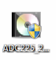
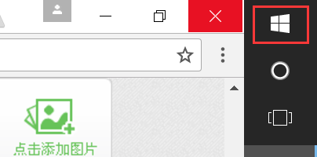
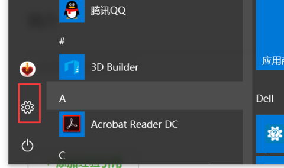
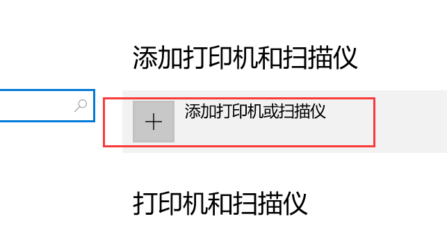
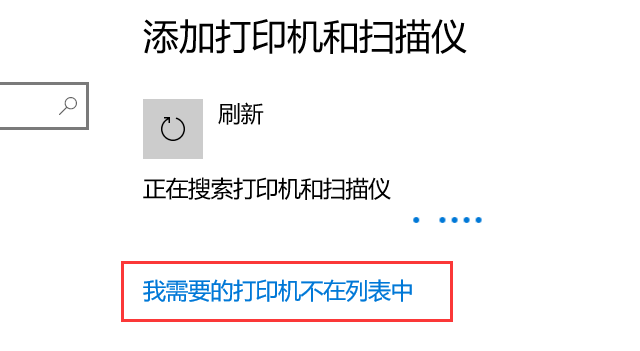
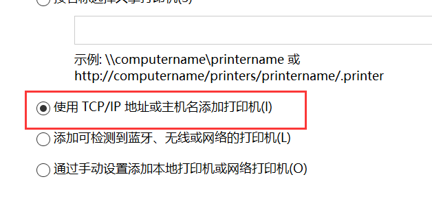
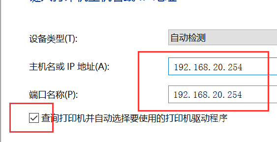

## 打印机安装方法

1、安装驱动。[驱动点击下载](http://work.lidig.com:8088/knowledge-base/wiki/blob/master/01%E6%96%B0%E6%89%8B%E6%8C%87%E5%8D%97/01%E9%80%9A%E7%94%A8%E7%9F%A5%E8%AF%86/assets/ADC225_265.exe  )

2、选择开始菜单或者点击键盘上的Windows键，然后选择设置 （或直接打开控制面板）。

3、点击设备。

4、点击“添加打印机或扫描仪”。

5、稍等一会，点击“我需要的打印机不在列表中”。

6、选择使用TCP/IP添加打印机。

7、输入打印机IP“192.168.20.254”，然后点击下一步 。

8、安装完成后，便可打印（打印机在集成中心处，打印完成后请及时拿取打印文件）。