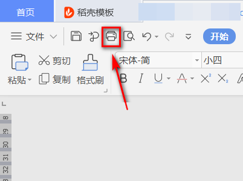
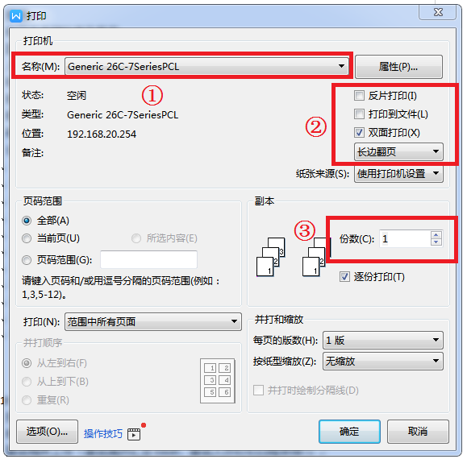

## 长城A260pn打印机使用方式

一、打开你所需要打印的文件，打开之后，点击“预览文件”（Ctrl+F2），看打印是否符合要求，如若正确点击打印按钮（Ctrl+P）：

​                                                  

 

二、在弹出框里我们设置一下，比如①确认打印机，②选择双面打印或单面打印，③打印份数。设置完毕后，点击窗口下发“确定”，开始打印。

   

 