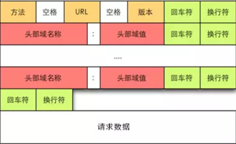

http协议的消息结构
============
http协议的请求消息和响应消息由一下4部分组成:
* 请求行/响应行
* 请求头部/响应头部
* 空行
* 消息主体（请求数据/响应数据）

## http消息结构图
### 请求消息结构图:

### 响应消息结构图:


-------------------------------------------------------------
## curl命令的例子:
```
$ curl -v www.baidu.com
* Rebuilt URL to: www.baidu.com/
*    Trying 180.101.49.12...
* Connected to www.baidu.com (180.101.49.12) port 80 (#0)
> GET / HTTP/1.1
> Host: www.baidu.com
> User-Agent: curl/7.47.0
> Accept: */*
>
< HTTP/1.1 200 OK
< Accept-Ranges: bytes
< Cache-Control: private, no-cache, no-store, proxy-revalidate, no-transform
< Connection: Keep-Alive
< Content-Length: 2381
< Content-Type: text/html
< Date: Wed, 03 Jul 2019 03:40:20 GMT
< Etag: "588604c8-94d"
< Last-Modified: Mon, 23 Jan 2017 13:27:36 GMT
< Pragma: no-cache
< Server: bfe/1.0.8.18
< Set-Cookie: BDORZ=27315; max-age=86400; domain=.baidu.com; path=/
<
... html格式的消息内容
```
-------------------------------------------------------------
## 请求
客户端发送一个HTTP请求到服务器包括一下格式:<br>
请求行（request line）、请求头部（header）、空行和请求数据四个部分组成。
### 请求行
#### 请求方法（也叫“动作”）:
* **GET**<br>
向指定的资源发出“显示”请求。使用GET方法应该只用在读取数据，而不应当被用于产生“副作用”的操作中
* **HEAD**<br>
与GET方法一样，都是向服务器发出指定资源的请求。只不过服务器将不传回资源的本文部分。它的好处在于，使用这个方法可以在不必传输全部内容的情况下，就可以获取其中“关于该资源的信息”
* **POST**<br>
向指定资源提交数据，请求服务器进行处理（例如提交表单或者上传文件）。数据被包含在请求本文中。这个请求可能会创建新的资源或修改现有资源，或二者皆有。
* **PUT**<br>
向指定资源位置上传其最新内容。
* **DELETE**<br>
请求服务器删除Request-URI所标识的资源。
* **TRACE**<br>
回显服务器收到的请求，主要用于测试或诊断。
* **OPTIONS**<br>
这个方法可使服务器传回该资源所支持的所有HTTP请求方法。用'*'来代替资源名称，向Web服务器发送OPTIONS请求，可以测试服务器功能是否正常运作。
* **CONNECT**<br>
HTTP/1.1协议中预留给能够将连接改为管道方式的代理服务器。通常用于SSL加密服务器的链接（经由非加密的HTTP代理服务器）。
* **PATCH**<br>
用于将局部修改应用到资源。

#### URL
例子: `http://www.aspxfans.com:8080/news/index.asp?boardID=5&ID=24618&page=1#name`
* 协议部分:	"http://"
* 域名部分:	"www.aspxfans.com"
* 端口部分:	":8080"
* 虚拟目录:	"/news/"
* 文件名:	"index.asp"
* 参数:		"?boardID=5&ID=24618&page=1"
* 锚:		"#name"

### 请求头部
| 头部字段名 | 说明 | 示例 |
| ---------- | ---- | ---- |
| Host | 服务器的域名(用于虚拟主机 )，以及服务器所监听的传输控制协议端口号 | Host:en.wikipedia.org:80 Host:en.wikipedia.org |
| Content-Type | 请求体的多媒体类型（用于POST和PUT请求中） | Content-Type: application/x-www-form-urlencoded |
| Cookie | 之前由服务器通过 Set- Cookie （下文详述）发送的一个 超文本传输协议Cookie | Cookie: $Version=1; Skin=new; |

更多信息查看wiki: [HTTP头字段](https://zh.wikipedia.org/wiki/HTTP%E5%A4%B4%E5%AD%97%E6%AE%B5)

#### 用户登录和Cookie的例子分析:
> * 客户端第一次访问服务器会发送GET的http请求，需要用户登录的服务器会响应403 Forbidden的状态码，且附带Content-Type: text/html格式的响应内容，包含了登录相关的html页面
> * 客户端在收到的html页面上填写账号密码后，点击确认会发送一个POST的http请求，包含了类型为Content-Type: application/x-www-form-urlencoded的请求数据，里面包含账号和密码信息
> * 服务器校验账号密码后返回头部字段里面包含如下信息Set-Cookie: sysauth=52f0a2497b3cc59ac147b7c6128a8786; path=/cgi-bin/luci/; HttpOnly
> * 客户端把服务器提供的cookie信息保存到本地内存或磁盘，后面的参数是cookie的权限范围.
> * 客户端发送http请求的时候只要在请求头中包含Cookie: sysauth=52f0a2497b3cc59ac147b7c6128a8786的信息,，访问权限范围内的数据就不需要输入账号密码了
> * 即便系统重启，Cookie如果存在，每次请求附带cookie信息后就不需要再重复登录了

### 请求数据
可选，由请求字段名Content-Type的内容决定
例如: application/json或application/xml。

#### Content-Type详解 [参考](https://blog.csdn.net/qq_14869093/article/details/86307084)
Content-Type（MediaType），即是Internet Media Type，互联网媒体类型，也叫做MIME类型。在互联网中有成百上千中不同的数据类型，HTTP在传输数据对象时会为他们打上称为MIME的数据格式标签，用于区分数据类型。最初MIME是用于电子邮件系统的，后来HTTP也采用了这一方案。

在HTTP协议消息头中，使用Content-Type来表示请求和响应中的媒体类型信息。它用来告诉服务端如何处理请求的数据，以及告诉客户端（一般是浏览器）如何解析响应的数据，比如显示图片，解析并展示html等等

[完整的Content-Type和内容文件的扩展名对照表](http://tool.oschina.net/commons)
##### Content-Type的格式：
    Content-Type：type/subtype ;parameter

* type：主类型，任意的字符串，如text，如果是*号代表所有
* subtype：子类型，任意的字符串，如html，如果是*号代表所有，用“/”与主类型隔开
* parameter：可选参数，如charset，boundary等

###### 例如：
* Content-Type: text/html;
* Content-Type: application/json;charset:utf-8;

##### 几种常见的Content-Type ([参考](https://www.jianshu.com/p/ba40da728806))
* application/x-www-form-urlencoded
* multipart/form-data
* application/json
* text/xml


-------------------------------------------------------------
## 响应
### 状态行
状态码：
> * 1xx：指示信息--表示请求已接收，继续处理
> * 2xx：成功--表示请求已被成功接收、理解、接受
> * 3xx：重定向--要完成请求必须进行更进一步的操作
> * 4xx：客户端错误--请求有语法错误或请求无法实现
> * 5xx：服务器端错误--服务器未能实现合法的请求

常见状态代码、状态描述、说明：
> * 200 OK      //客户端请求成功
> * 400 Bad Request  //客户端请求有语法错误，不能被服务器所理解
> * 401 Unauthorized //请求未经授权，这个状态代码必须和WWW-Authenticate报头域一起使用
> * 403 Forbidden  //服务器收到请求，但是拒绝提供服务
> * 404 Not Found  //请求资源不存在，eg：输入了错误的URL
> * 500 Internal Server Error //服务器发生不可预期的错误
> * 503 Server Unavailable  //服务器当前不能处理客户端的请求，一段时间后可能恢复正常

### 响应头部
| 头部字段名 | 说明 | 示例 |
| ---------- | ---- | ---- |
| Server     | 服务器的名字| Server: Apache/2.4.1 (Unix) |
| Content-Length | 回应消息体的长度，以字节（8位为一字节）为单位 | Content-Length: 348 |
| Content-Type | 当前内容的MIME类型 | Content-Type: text/html; charset=utf-8 |
| Set-Cookie | [HTTP cookie](https://zh.wikipedia.org/wiki/Cookie) | Set-Cookie: UserID=JohnDoe; Max-Age=3600; Version=1 |

更多信息查看wiki: [HTTP头字段](https://zh.wikipedia.org/wiki/HTTP%E5%A4%B4%E5%AD%97%E6%AE%B5)

### 响应数据
由请求字段名Content-Type的内容决定，可选
