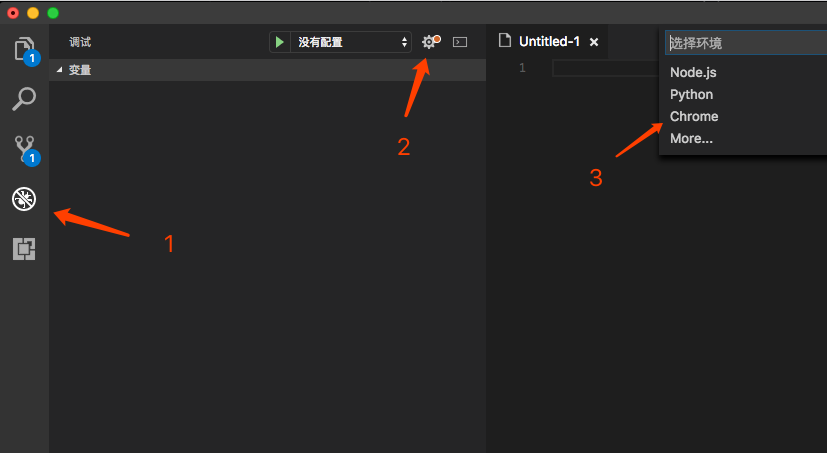
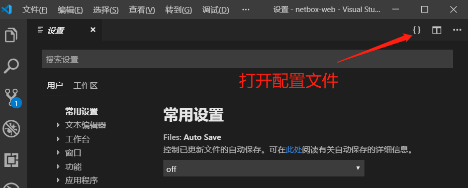

# vscode
###  插件集
 1. Chinese（中文语言包）
 2. Debugger for Chrome（断点调试）
 3. EditorConfig for VS Code（定义和维护跨IDE代码风格）
  4. TSLint（TypeScript语法规则和代码规范的检查工具）
  5. ESLint（JavaScript语法规则和代码规范的检查工具）
  6. Prettier（代码风格格式化工具）
  7. Stylelint（css代码规范工具）
  8. GitLens — Git supercharged（日志查看工具）
  9. Document This（函数注释工具）

#### Debugger for Chrome

安装并重新加载vscode后，可以直接点击调试按钮并创建新的启动配置。如果你之前已经创建过启动配置了，就可以直接打开 .vscode/launch.json 进行修改。



配置代码:
```
{
	// 使用 IntelliSense 了解相关属性。 
	// 悬停以查看现有属性的描述。
	// 欲了解更多信息，请访问: https://go.microsoft.com/fwlink/?linkid=830387
	"version": "0.2.0",
	"configurations": [
	    {
	        "type": "chrome",
	        "request": "launch",
	        "name": "Launch Chrome",
	        "url": "http://localhost:8000",
	        "webRoot": "${workspaceFolder}"
	    }
	]
}
```

配置字段信息解释：
 - version : 你定义这个配置文件的版本，生成的时候默认是0.2.0
 - configuration：配置域
 - type：调试的类型
 - request : 配置文件的请求类型，有launch和attach两种，launch是由 vscode 来启动一个独立的具有 debug 模式的程序
 - name：配置文件的名字，可以自己起
 - url：这个是chrome插件带的，指定访问的链接，8000 是项目指定的端口号
 - webRoot：也是chrome插件带的，指定根目录或者执行文件
 - ${workspaceRoot}：就是你打开vscode读取的项目目录


### 配置项
	文件 -> 首选项 -> 设置 -> 打开配置文件


配置项代码：
```
{
    // 调整窗口的缩放级别。原始大小是 0，每次递增(例如 1)或递减(例如 -1)表示放大或缩小 20%。也可以输入小数以便以更精细的粒度调整缩放级别
    "window.zoomLevel": 0,

    // 单击文件在新的Tab页显示
    "workbench.editor.enablePreview": false,
    
    // 控制字体系列，linux环境下需要更换字体，windows选配
    "editor.fontFamily": "Consolas, 'Courier New', monospace",
    
    // 控制已更新文件的自动保存。接受的值:“off”、“afterDelay”、“onFocusChange”
    "files.autoSave": "onFocusChange",
    
    // 配置文件路径的 glob 模式以从文件监视排除。更改此设置要求重启。如果在启动时遇到 Code 消耗大量 CPU 时间，则可以排除大型文件夹以减少初始加载
    "files.watcherExclude": {
        "**/.git/objects/**": true,
        "**/.git/subtree-cache/**": true,
        "**/node_modules/*/**": true
    },
    
    // 配置 glob 模式以排除文件和文件夹
    "files.exclude": {
        "**/.git": true,
        "**/.DS_Store": true
    },
    
    // 配置 glob 模式以在搜索中排除文件和文件夹。从 files.exclude 设置中继承所有 glob 模式
    "search.exclude": {
        "**/node_modules": true,
        "**/bower_components": true
    },
    
    // 启动 自动修复tslint错误
    "editor.codeActionsOnSave": {
        "source.fixAll.tslint": true
    },

    // 保存的时候自动修复一些空格缩进,单双引号及语句末尾是否需要加;或,的一些错误
    "eslint.autoFixOnSave": true,

    // 显示eslint插件运行过程中的信息
    "eslint.trace.server": "messages",

    // eslint支持检测js、jsx、ts、tsx文件
    "eslint.validate": [
        "javascript",
        "javascriptreact",
        {"language": "typescript", "autoFix": true},
        {"language": "typescriptreact", "autoFix": true}
    ],
    
    // 启用/禁用 对话框
    "explorer.confirmDelete": false,
    
    // 移动文件时总是自动更新引用
    "javascript.updateImportsOnFileMove.enabled": "always",
    
    // 一个制表符等于的空格数。
    "editor.tabSize": 2

}
```
