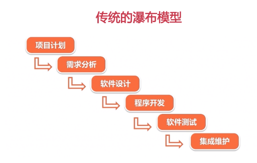
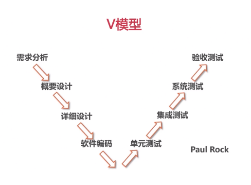
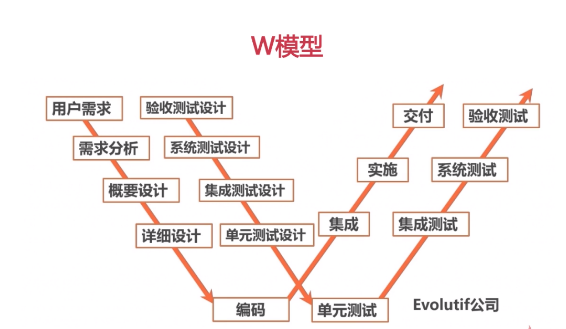
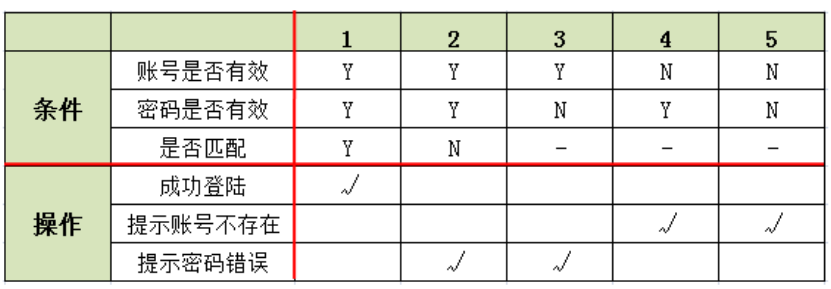
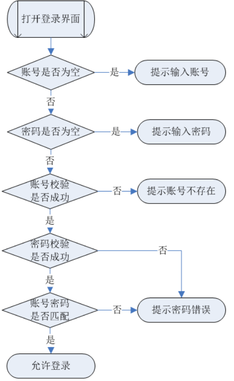
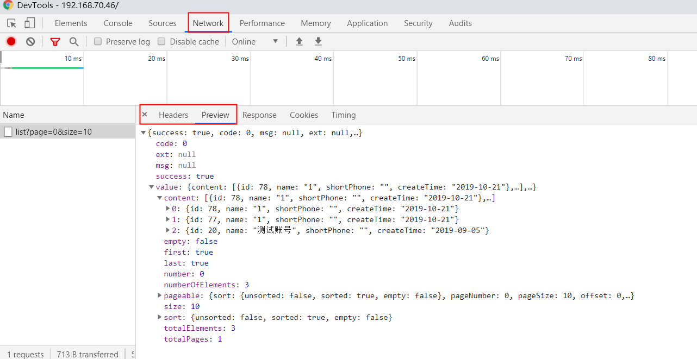

[TOC]

# 一、 软件基础理论

## 1.1软件生命周期

可行性研究(立项)->需求分析->软件设计(概要、详细)->编码->测试->运维。

## 1.2软件测试流程

参与需求分析及评审->测试计划及测试方案制定->测试案例设计->环境及数据准备->测试执行->报告输出封版

功能测试一般的执行次序：<u>冒烟测试、系统测试、**回归测试**</u>（bug验证只是回归的一部分，回归可全系统也可根据出现BUG情况部分选择回归测试，最低标准需要保证系统业务流程正常）

备注：ST环境的系统测试完成后，一般会在UAT环境上进行验收测试，验收测试侧重于流程和功能需求实现。

## 1.3软件模型

瀑布、V、W、X、H模型。

瀑布模型：

**V模型（普遍）：**

W模型：

## 1.4软件测试分类

1、黑盒、白盒、灰盒（根据是否查看代码分类）

2、单元测试（UT）、**集成测试（IT）、系统测试（ST）、验收测试（UAT）**（根据开发阶段分类）

3、业务功能测试、兼容测试、性能测试、安全测试、用户体验测试、安装测试、文档测试（根据测试对象来分类）

## 1.5缺陷等级划分

根据严重登记大致可分为：致命、严重、一般、建议。对应我司禅道系统P1-P4的等级划分。

**致命**：造成系统崩溃、死机、死循环，导致数据库数据丢失，主要功能丧失，基本模块缺失等问题。

**严重**：系统主要功能部分丧失，用户数据丢失，功能设计与需求严重不符，模块无法启动或调用关联程序间调用冲突，安全问题、稳定性等。

一般：功能存在问题但不影响业务继续开展，数据来源不正确，无数据有效性校验校验或校验不合理，响应时间超出合理范围、在声明支持的平台下出现兼容问题等。

建议：不影响操作功能的执行，可以优化性能的方案等。如：错别字、界面格式不规范，页面显示重叠，光标位置不正确，用户体验感受不好等。

# 二、 测试用例设计

常用的用例设计方法：等价类、边界值、错误推测法、场景法、因果图、判定表等。

等价类：有效等价类、无效等价类。

**边界值**：临界值范围考虑，如等于、刚大于、刚小于的数据点。

错误推测法：根据业务经验及直觉推测软件可能存在的错误从而去验证。

场景法：根据主分支流向，将业务流程场景化，侧重流程测试。

以登录为例：

1、如账号长度为5-10位，则有效等价类[5-10]，无效等价类：<5或者>10

2、如账号长度为5-10位，则边界值：4、5、10、11位

3、判定表则可如下（注：Y正确，N错误，√代表动作结果）：

4、场景化设计（登录分支流如下，被测业务流是多个模块相关联的要考虑其正确分支错误分支）：

# 三、 问题分析与定位

## 3.1使用工具

浏览器自带开发者工具（F12）、三方抓包工具（Fiddler等，可对APP请求抓包）、程序日志文件

## 3.2问题定位

1、样式问题（前端），逻辑数据交互（后端）

2、http请求状态码：4XX 请求错误（前端）；5xx、6xx 服务器错误（后端）

3、请求报文错误为前端，返回结果错误为后端

4、定位不了的问题，与开发沟通。

参考：https://blog.csdn.net/qq_30758629/article/details/81012222

 