# 软件测试

[TOC]

------

## 一、测试流程定义

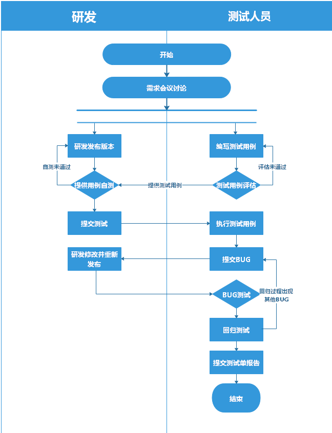

完整测试流程如下：

- 需求会议讨论
- 编写测试用例

测试用例编写规范参考[三、测试用例书写](#三测试用例书写)

- 测试用例评估

  **测试用例由产品经理评估，完成后需要提交一份需求主要功能相关的测试用例给研发，研发根据测试用例执行冒烟测试。**

- 冒烟测试

测试团队在提交测试单之后需要完成一份主要功能的测试用例提交研发进行冒烟测试，在测试过程中冒烟测试执行失败超过一定基数（百分之50）直接打回。

- 研发提交测试单

需求确认的情况下研发需要在开发前确认提交测试单。

- 执行测试用例

完整周期下测试用例执行需要起码两位测试进行，一轮测试周期（执行测试用例-提交BUG-BUG回归）后由另一位测试人员进行第二轮执行。

- 提交BUG

BUG提交标准参考[四、禅道BUG提交规范](#四禅道BUG提交规范)。

- BUG回归

BUG回归时若产生其余BUG则需要提交BUG给研发。

- 提交测试单报告

提交测试单报告时，测试单状态应保证测试单对应的当前版本仅存在优先级不高或者研发明确表示后续版本处理的BUG。

## 二、禅道测试相关

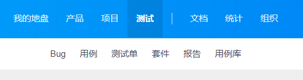

/测试人员在使用禅道时会使用以下几项功能，各功能之间关系的梳理如下：

- 用例库

多个产品间复用率高的用例在用例库中管理，测试单引用重复用例也可以从用例库中导入。例如：浏览器兼容测试、系统兼容测试、多产品间UI样式统一测试。

- 测试单

测试单由研发经理提交，提交后的测试单由测试人员进行用例关联并执行。

- 套件

一个套件对应一个产品的基础测试用例，将相关测试用例关联到套件中，方便下次在测试单中关联测试用例。注意：用例更新后需要在套件中查看对应用例的版本并确认是否更新到最新用例。

- 测试用例

用于对某一个功能或者模块进行测试，测试用例中内容必须完整填写，步骤对应语气。执行失败的测试用例需要生成对应BUG，并指派相关人员。

- 报告

测试单执行完成后需要进行报告提交，新版本禅道能够多测试单生成一份报告。

## 三、测试用例书写

测试用例书写需要进行规范，具体书写内容规范如下。

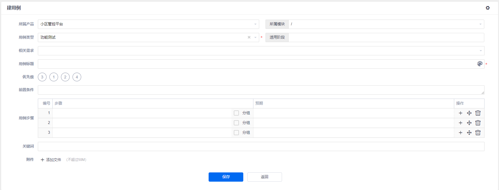

- 所属产品：必选

测试用例所属产品为必选项，提交的测试用例会出现在对应产品下。

- 所属模块：必选

测试用例所属模块为必选项，切换所属产品时模块内容会随即切换，如果没有模块内容需提醒用户及时更新模块内容。

- **用例类型：必选**

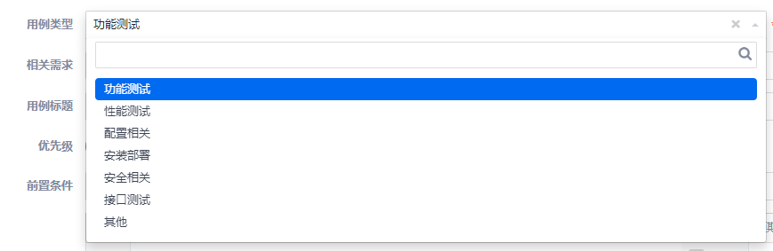

1.功能测试：验证功能是否完善的相关测试用例类型

举例：网页按钮的点击测试。

2.性能测试：压力测试或者老化测试对应的相关测试用力类型

举例：接口并发测试系统负载。

3.配置相关：系统、网页等在系统部署之前或之后的配置环境测试用例类型。使用较少

举例：系统部署完成后修改配置文件或配置文件故意丢失。

4.安装部署：系统部署，软件程序安装相关的测试用例类型。使用较少

举例：在win10以及win7环境下安装部署软件。

5.安全相关：软件程序网页在运行过程中系统的安全相关测试用例类型，使用较少，一般由研发提出

举例：输入控件在输入查询数据库时可能没有进行转义，可以通过直接在输入控件中输入代码获取数据库权限。

6.接口测试：接口测试相关测试用例类型

举例：模拟登陆操作发起的http请求查看服务器返回内容。

7.其他

- 相关需求：必选

研发在产品讨论时会确认下产品相关需求。

- **用例标题：必填**

用例标题内容书写规范：所属模块-细分模块-涉及功能或接口（可以没有）。

举例：首页-登陆-注册功能

- **优先级：必选**

1.优先级1：最先，第一优先完成该部分测试用例的执行，若没有该优先级的测试用例则继续往下执行。

2.优先级2：次要，第二优先完成该部分测试用例的执行，若没有该优先级的测试用例则继续往下执行。

3.优先级3：正常，第三优先完成该部分测试用例的执行，若没有该优先级的测试用例则继续往下执行。

4.优先级4：最后，最后完成该部分测试用例的执行。

- 前置条件：必填

执行用例前必备的前置条件，以”；“分割各条件。

举例："admin"账号登陆系统；打开首页；

- 用例分组：可选

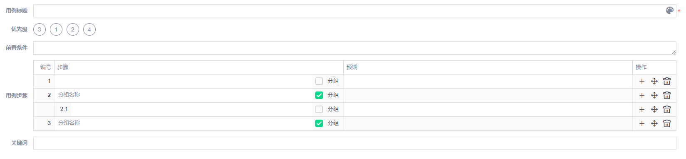

可以根据测试需要创建分组，填写子步骤。同一功能中存在许多需要测试的点，以同一功能不同测试点或测试数据为分组基础，对功能涉及的操作以及后续操作细分到此用例分组中，分组名称书写规范：功能名称-测试点。

举例：在人员页面下的新增功能，新增功能的页面数据内容为用例分组的基础，在“新增-页面数据”分组下，点击新增以及产生的后续用例步骤都归于“新增页面数据”分组。

操作：点击分组，对应步骤变为分组名称，填写分组名称后点击右侧“+”进行分组内步骤的新增

- **用例步骤以及结果：必填**

用例步骤与结果对应，用例步骤书写规范：操作-控件-输入内容，预期结果书写规范：操作结果-预期现象。

举例：用例步骤：输入-账号输入框-"admin"。预期结果：输入成功-输入框显示"admin"。

- 关键词：选填

建议填写当前测试用例涉及到的控件名称。

## 四、禅道BUG提交规范

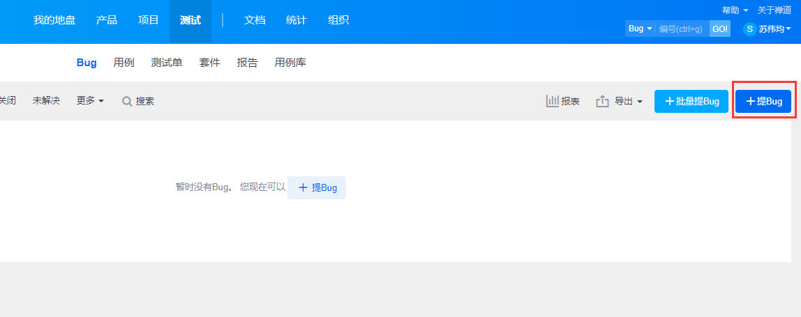

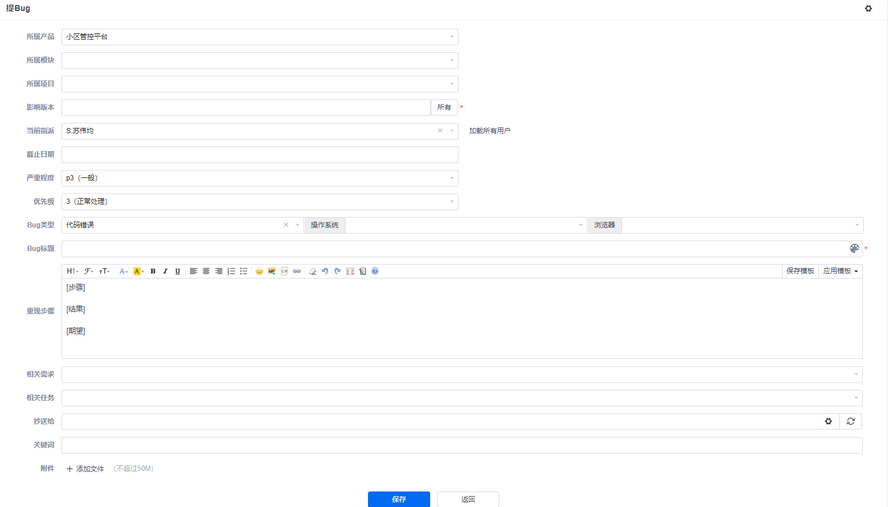

- 所属产品：必选
- 所属模块：必选
- 所属项目：可选
- 影响版本：必选
- 当前指派：必选

指派人员为出现BUG的模块对应的研发人员，不确认研发则指派主管。

- 截止时间：可选
- 严重程度：必选

严重程度分为致命、严重、一般、建议。

1.致命：阻碍开发或测试工作的问题；造成系统崩溃、死机、死循环，导致数据库数据丢失， 与数据库连接错误，主要功能丧失，基本模块缺失等问题。

2.严重：系统主要功能部分丧失、数据库保存调用错误、用户数据丢失，一级功能菜单不能使用 但是不影响其他功能的测试。安全问题、稳定性等。

3.一般：功能没有完全实现但是不影响使用，功能菜单存在缺陷但不会影响系统稳定性。

4.建议：界面、性能缺陷，建议类问题，不影响操作功能的执行，可以优化性能的方案等。

- 优先级：必选

优先级分为：1（立即处理）、2（紧急处理）、3（正常处理）、4（有时间处理）。

- BUG类型：必选

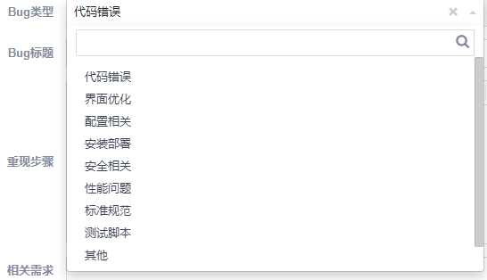

1. 代码错误：系统无法运行或者运行时报错，优先级和严重程度较高，视具体情形来定。
2. 界面优化：一般为界面易用性建议优化，优先级和严重程度较低。
3. 配置相关：后台配置或运行相关配置需要修改。
4. 安全相关：系统漏洞和安全相关出现问题，优先级和严重程度较高。
5. 性能问题：系统负载以及页面加载出现异常，时间较长。优先级和严重程度较高。
6. 标准规范：一般不影响使用，但是需要根据公司规定来调整程序。优先级和严重程度较低。
7. 其他

- 操作系统：必选
- 浏览器：必选
- BUG标题：必填

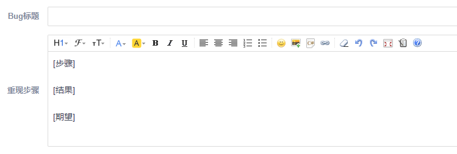

BUG标题内容书写规范：所属模块-细分模块（可以没有）-具体操作和对应现象简单描述。例如：登陆-账号输入后点击登陆按钮报错。

- 重现步骤：必选

a.步骤：需要具体描述能够复现BUG的步骤，多步骤则分步书写，未出现问题的部分可简单描述略过。步骤书写规范：

1. 页面-操作-输入数据（输入数据必须带引号“”）
2. 操作-输入数据（输入数据必须带引号“”）

举例：

1. 登陆页面点击输入框输入"admin"
2. 点击注册按钮

b.结果：根据上述步骤操作后会出现的结果，可以使用文字描述或者使用图片描述。

c.期望：根据步骤操作后应该出现的期望，在不明确需求时测试需要具体描述期望内容。

举例：登陆界面账号输入后无法点击注册按钮/登陆界面账号输入后点击注册按钮能够正常跳转注册页面。

- 相关需求：必选

  BUG提交必须选择相关需求，有需求才有相应BUG产生。

- 相关任务：可选

- 抄送给：可选

- 关键字：可选

## 五、用例版本控制

因为需求与用例必须关联，而需求在每个版本都会进行新增，所以用例的数量也会出现增长，而弃用用例时在用例后加适用版本无法准确表达用例适用哪个版本到哪个版本，所以现在需要明确用例的版本控制流程。

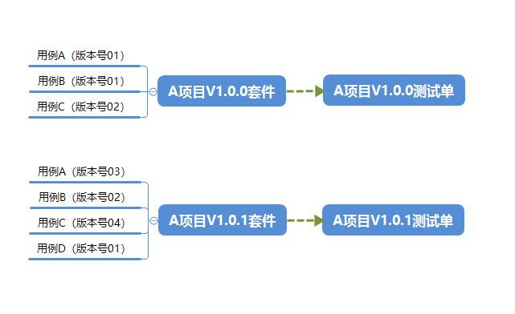

- 用例版本控制目的：

最新用例只关联最新版本需求下，保证测试用例不会随需求数量增长。不会出现重复的仅适用于老版本的测试用例。当出现需要历史项目版本切出时，通过测试单引用套件的方式完成历史版本用例的引用执行。

- 用例版本控制实现：

1. 测试用例版本：

   新版本的需求在重复内容的用例上修改，并关联最新版本的用例。

2. 套件：

   套件添加用例时会保存当前用例的版本，也可以选择特定的用例版本，在每次项目版本完结时，新增当前版本的测试用例到版本套件中，测试单引用套件时会自动关联套件中的用例版本，以达到不关心老版本需求时能够提供项目历史版本的测试用例。

   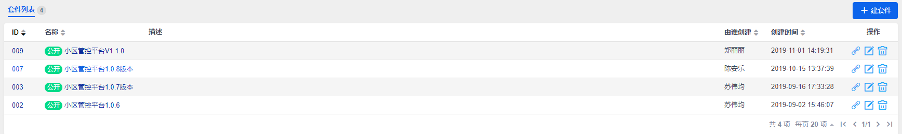

3. 测试单：

   完成测试单关联套件操作，关联的测试用例版本为套件中关联的版本。测试单关联的历史版本用例时会出现用例版本更新的按钮，只要测试人员不更新，执行的用例便是历史的用例版本。

   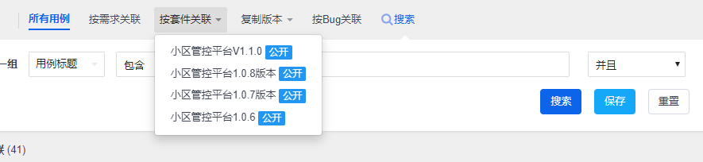