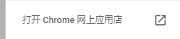
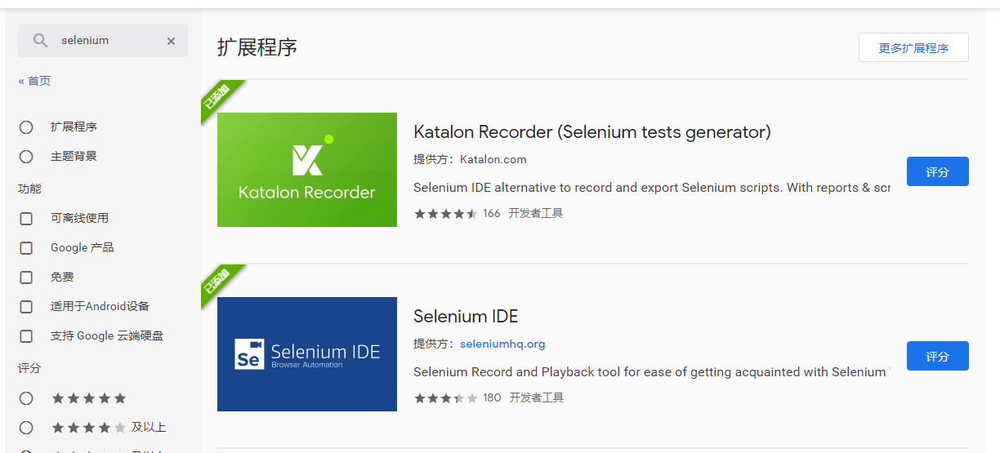

# Selenium+python

## 一、自动化流程说明

大致流程简述：

1. 使用工具录制用例脚本，并分门别类。
2. 转化录制的用例脚本为Python脚本，编辑优化完善，使其能够实现更多录制时候无法操作的地方
3. 持续部署集成，暂定在项目提交更新后触发测试用例的运行，并完成后出具报告发送邮箱。

关于测试用例套件以及分类

1. 暂定测试用例套件的名称参考禅道模块划分下的一级模块，例如：物业助手-基础数据，因中文的关系，以首字母拼音代替：wyzs-jcsj
2. 暂定测试用例套件下的测试用例名称以禅道中对应测试用例的名称，例如：物业助手-基础数据-小区基础数据，因中文的关系，以首字母拼音代替：wyzs-jcsj-xqjcsj

## 二、Selenium IDE说明

Selenium IDE是录制用户操作并记录回放的软件，程序为chrome插件。

### 2.1 Selenium IDE安装

1. 打开chrome扩展程序

   

2. 点击扩展程序打开chrome网上应用店

   

   

3. 搜索Selenium IDE安装

   

4. 右击已安装的Selenium点击管理扩展程序

   

5. 打开允许访问文件地址

   

### 2.2 Selenium IDE功能说明

1. 套件名称、用例名称规范：除用例步骤中能够出现中文外，用例名称、套件名称一律不得出现中文，用例命名以禅道中对应的用例中文首字母表示，套件名为用例大模块的中文首字母表示。

2. 定位方式建议：建议优先xpath定位元素，原则为一次定位后在页面小变动之后能够继续定位元素而不需要修改。

3. 变量定义：

   1. store命令，定义的变量为文本，用法：

      | command | store  |
      | ------- | ------ |
      | target  | 变量值 |
      | Value   | 变量名 |

      变量名引用：${变量名}

   2. execute script命令，执行脚本定义变量，定义的变量为数字，用法：

      | command | execute script |
      | ------- | -------------- |
      | target  | return 数值    |
      | Value   | 变量名         |

      变量名引用：${变量名}

4. 执行循环：

   1. times-end命令，循环执行，后接执行次数，用法：

      

   2. if-else if-else-end命令，条件执行，if或else if后接js脚本判断，用法

      

5. 调用共用模块执行：

   run命令，后接用例名称，用法：

   | command | run      |
   | ------- | -------- |
   | target  | 用例名称 |
   | Value   |          |

6. 上传图片、文件：

   type命令，上传控件的元素定位不能使用xpath定位，用法：

   | command | type         |
   | ------- | ------------ |
   | target  | 元素定位     |
   | Value   | 本地文件地址 |

7. 校验方式：

   建议使用verify以及wait for命令，少部分情况使用assent，常用命令用法说明：

   | command                    | 说明                                                        |
   | -------------------------- | ----------------------------------------------------------- |
   | verify                     | 验证变量与预期相符                                          |
   | verify editable            | 验证控件可编辑                                              |
   | verify not editable        | 验证控件不可编辑                                            |
   | verify element present     | 验证控件存在                                                |
   | verify element not present | 验证控件不存在                                              |
   | verify title               | 验证页面title符合预期                                       |
   | verify text                | 验证控件的text符合预期，与value区别：输入框的说明文字为text |
   | verify value               | 验证控件的value符合预期，与text区别：可输入框的内容为value  |
   | wait for element visible   | 等待控件显示，控件可能已存在但不显示，需要输入超时时间value |
   | wait for element present   | 等待控件存在，需要输入超时时间value                         |
   | wait for element editable  | 等待控件可编辑，需要输入超时时间value                       |

8. Xpath定位方式：

   列举几项常用定位方式，其中*表示需要定位的目标目录节点，、#表示需要搜索的文字

   | 定位方式         | 说明                          |
   | ---------------- | ----------------------------- |
   | 模糊定位(唯一值) | //\*                          |
   | 模糊搜索         | //\*[contains(.,"\#")]        |
   | 定位父节点       | //\*[contains(.,"\#")]\.\.    |
   | 定位同级节点     | //\*[contains(.,"\#")]\.\./\* |

