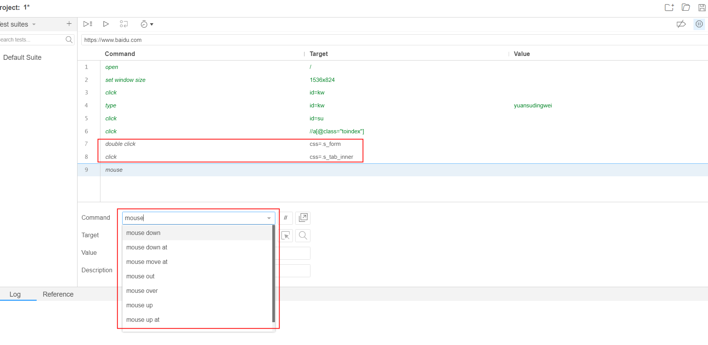

[TOC]

# 一、元素定位

## 1.查看元素

**检查元素：**

**判断元素个数：**

在当前调出来的开发者工具上，**Ctrl+F**打开查找，输入定位方式筛选出元素及展示元素出现的个数

（备注：做自动化测试时定位到的元素需要唯一）

当seleniumIDE在录制过程中定位不到隐藏的元素时，可以手动输入目标元素的定位。定位元素方式有id、name、xpath等。

## 2.定位方式

下述加粗为常用的定位方式。

**id定位**：**find_element_by_id()**  。id是唯一的，所以有id属性的元素定位使用id。

**name：find_element_by_name()**，元素中有name属性可用。

**xpath定位：find_element_by_xpath()**，路径定位灵活常用。

class定位：find_element_by_class_name()

tag定位：find_element_by_tag_name()，元素标签名如input、submit。

**link定位：find_element_by_link_text()**，链接内容文字。

partial_link定位：find_element_by_partial_link_text()，可模糊匹配超链接内容

css定位：find_element_by_css_selector()

# 二、键盘鼠标事件

使用键盘鼠标事件即可模拟键盘输入、鼠标操作的效果。

## 1.键盘事件

| 事件              | command                      |
| ----------------- | ---------------------------- |
| F 1-F12键         | send_keys(Keys.F1)           |
| Crtl+a键(c、v、x) | send_keys(Keys.CONTROL, 'a') |
| Tab键             | send_keys(Keys.TAB)          |
| Enter键           | send_keys(Keys.ENTER)        |
| Backspace键       | send_keys(Keys.BAKSPACE)     |
| 空格键            | send_keys(Keys.SPACE)        |

导入包：**from selenium.webdriver.common.keys import Keys**

在seleniumIDE中键盘输入关键字为send keys。比较常用的键盘输入：删除、回车、F5。

## 2.鼠标事件

| 事件 | command         |
| ---- | --------------- |
| 单击 | click()         |
| 双击 | double_click()  |
| 右击 | context_click() |
| 拖动 | drag_and_drop() |

导入包：**from selenium.webdriver.common.action_chains import ActionChains**

在seleniumIDE中鼠标事件如下图，自动化测试中常用的有单击、双击操作。

脚本如下：

# 三、断言

在SeleniumIDE中可以使用assert、verity、wait for方式来检查页面结果是否满足要求。

## 1.等待

等待分为pause、wait for两种方式。

pause即设置固定的时间来休眠，休眠之后再执行之后的脚本命令，常用于页面加载等待。

wait for即在设置的时间内等待元素出现，若元素出现则通过继续执行后续脚本，元素未出现则失败不再执行后续脚本。value的单位为ms，当为空值则默认等待60秒。

## 2.断言

使用assert来断言，若检查通过则继续执行之后的用例，失败则停止执行。IDE中assert提供了较多的断言方式，可以使用text、title、value、element present来断言，在项目中可根据具体场景使用其他断言。

## 3.验证

使用verity来验证页面是否满足检查结果，与assert不同的是verity校验不通过时可以继续执行之后的用例脚本。通常也可以结合store(定义变量)来使用，将校验点存储为变量，然后vertiy的value等于定义的变量即可，这样做比较灵活。

