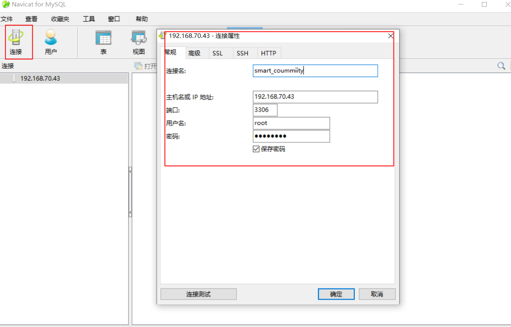
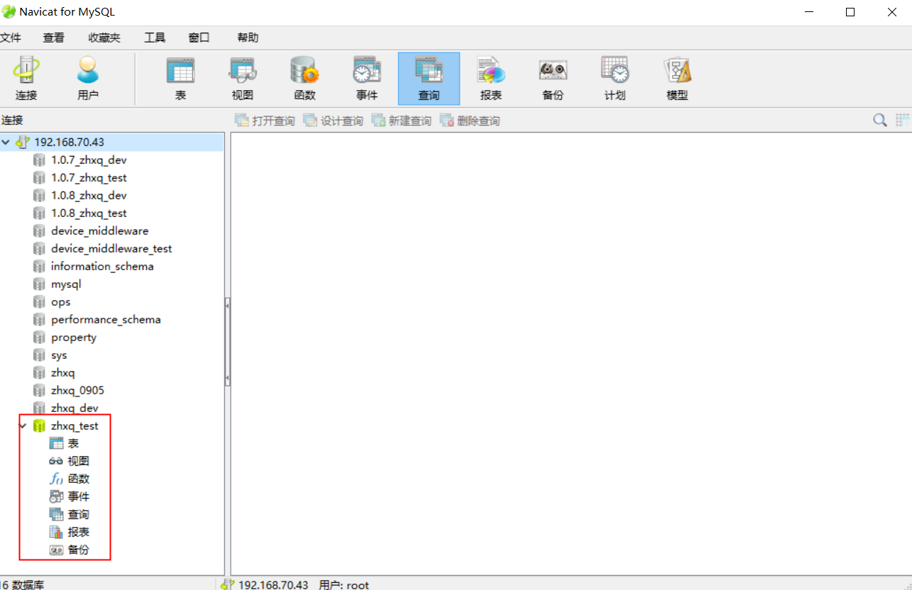
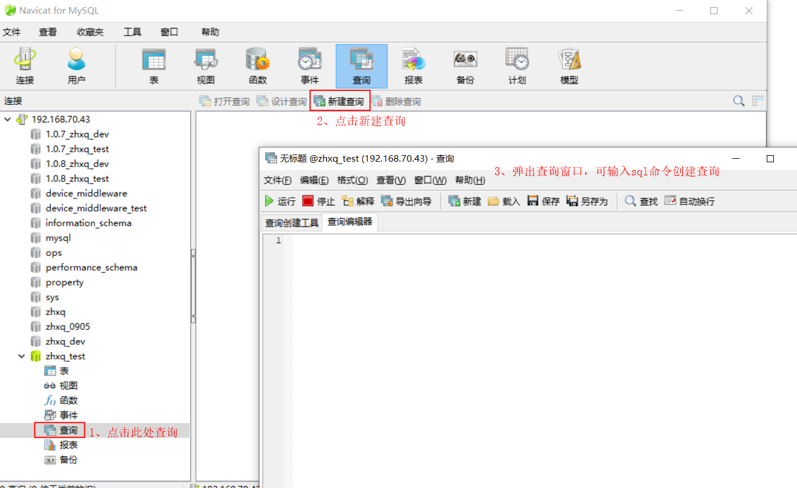
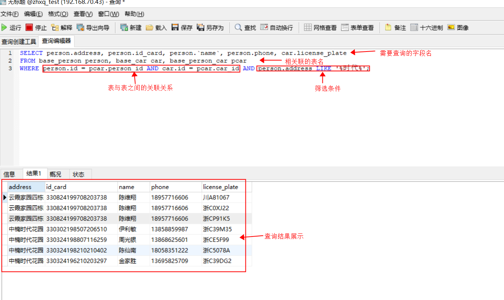
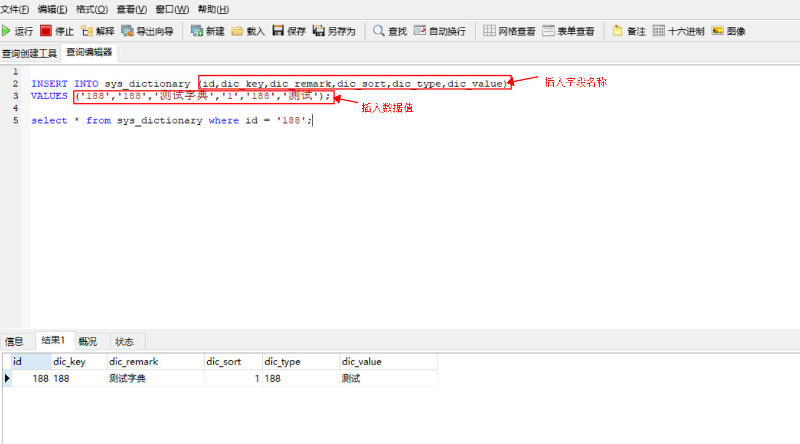
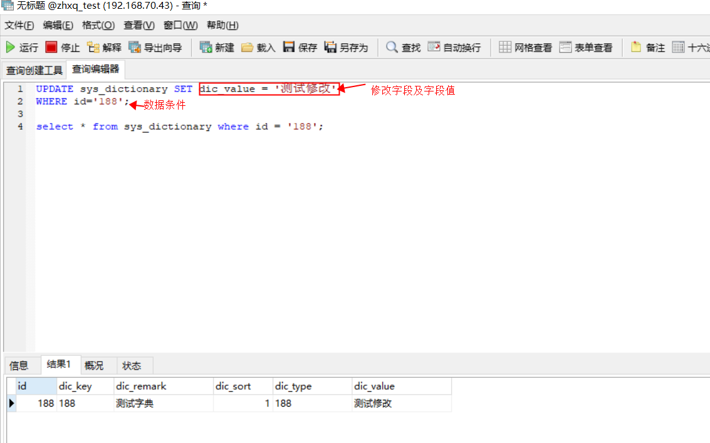
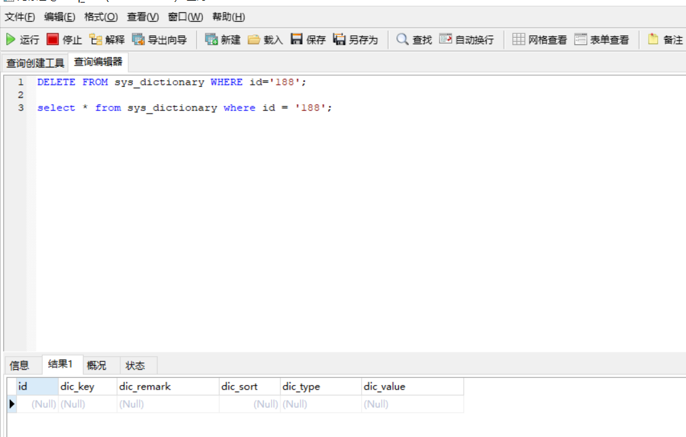

# 一、连接数据库

说明：测试过程中可能会涉及到数据比对或者造数测试的场景，需要了解一些简单的数据库知识，下面以样例形式简单介绍mysql的基本操作。

Navicat安装完成后打开，点击左侧**[连接]**按钮，在对话框中输入连接信息点击**[确定]**。



确认连接后，在左侧连接列表中双击连接名，再双击需要连接的数据库名，显示绿色代表正常连接。



# 二、sql基本操作

调起查询窗口，输入sql语句点击左上角**[运行]**即可查询数据。



1、查询

语法：

```
SELECT column_name,column_name
FROM table_name
[WHERE Clause]
```

单表查询：select * from table_name 。

web页面上展示的数据大都是从多个相关联的表中取数，多表查询样例如下图展示。



2、插入

语法：

```
INSERT INTO table_name ( field1, field2,...fieldN )
                       VALUES
                       ( value1, value2,...valueN );
```



3、修改

语法：

```
UPDATE table_name SET field1=new-value1, field2=new-value2
[WHERE Clause]
```



4、删除

语法：

```
DELETE FROM table_name [WHERE Clause]
```



**备注：做修改和删除操作时必须加入where条件，否则会更改整表数据。**