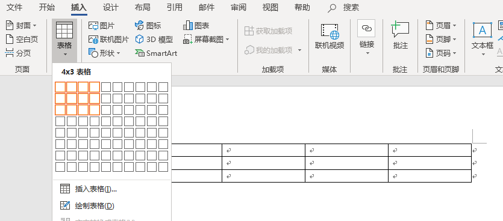

## 研发中心文档编写规范

#### 1.范围

本标准规定了应作为文书档案保存的归档文件的整理原则和方法。

本标准适用于研发中心作为文书档案保存的归档文件的整理。

#### 2.名词解释

##### 2.1.模板文档

模板文档是用于编写各类文档的标准，采用 office 的模板格式进行存储。

##### 2.2.规范化文档

规范化文档是指对于格式和内容都有严格要求的文档。对于为客户提供的技术文档、公司内部制度流程文档、技术标准与规范文档等等，都属于规范化文档之列。

##### 2.3.记录类文档

记录类文档是值用于记录信息的文档，在撰写上注重内容，弱化形式。例如开发过程中使用的各类文档等等。记录类文档尽量多用表格方式进行记录，要注重内容，对于文档排版上的要求可以尽量从简。

##### 2.4.演示文档

要是文档是指用于PPT演示材料的文档。

#### 3.文档编写格式要求

##### 3.1.文档打印

要求用计算机排版A4纸打印。左右页边距各3.17cm、上下页边距各2.5cm。

##### 3.2.页眉页脚

页眉：左上角公司logo。

页码：第x页  共x页（宋体小五号）。居中标于页面底部（页码内容自动生成）。

##### 3.3.封面

标题宋体小二加粗，居中。

##### 3.4.目录

宋体三号加粗，居中；目录内容自动生成，宋体五号。

##### 3.5.正文标题

标题分为四级（1. 、1.1. 、1.1.1. 、1.1.1.1.）：

- 一级标题：文章的标题（宋体三号加粗）；
- 二级标题：文章主要部分的大标题（小三号加粗）；
- 三级标题：二级标题下面一级的小标题（四号加粗）；
- 四级标题：三级标题下面某一方面的小标题（小四号加粗）。

标题原则：

- 一级标题下，不能直接出现三级标题；
- 标题要避免孤立编号（即同级标题只有一个） ；
- 下级标题不重复上一级标题的名字 ；
- 谨慎使用四级标题，尽量避免出现，保持层级的简单，防止出现过于复杂的章节。
- 如果三级标题下有并列性的内容，建议只使用项目列表（Item list）。

##### 3.6.正文

宋体小四；行间距1.5倍行距；段落首行缩进2个字符；插图与图表居中。

##### 3.7.表格样式设置注意事项

无特殊原因，表格必须统一采用以下样式。表格的宽度，统一采用“根据窗口调整表格”方式，无需自行设置；

操作具体过程：“菜单栏 > 插入 > 表格 >  选择相应的数量... ”

